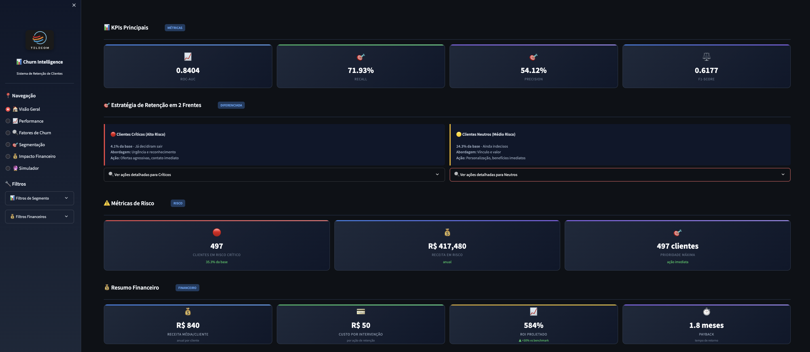
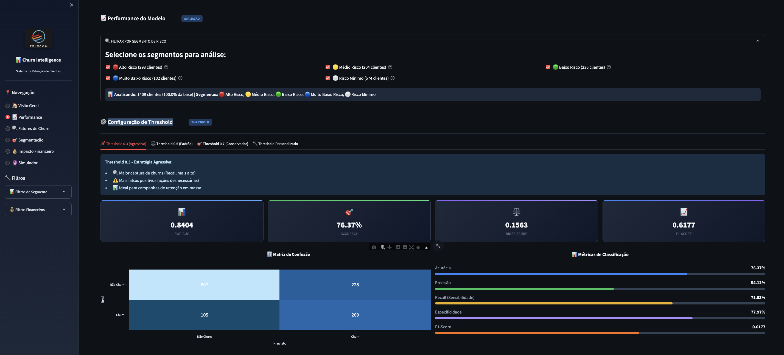
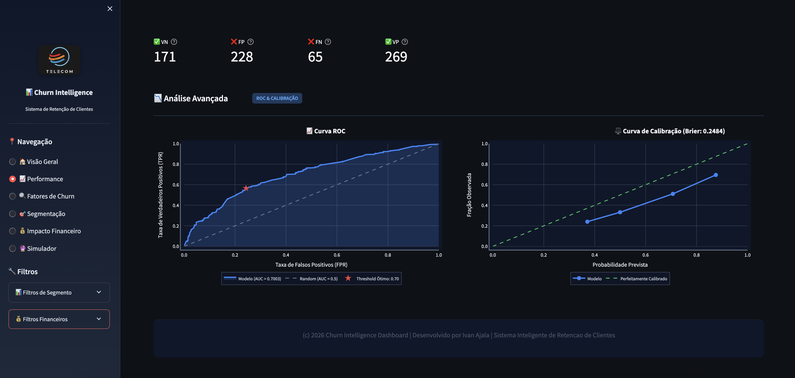
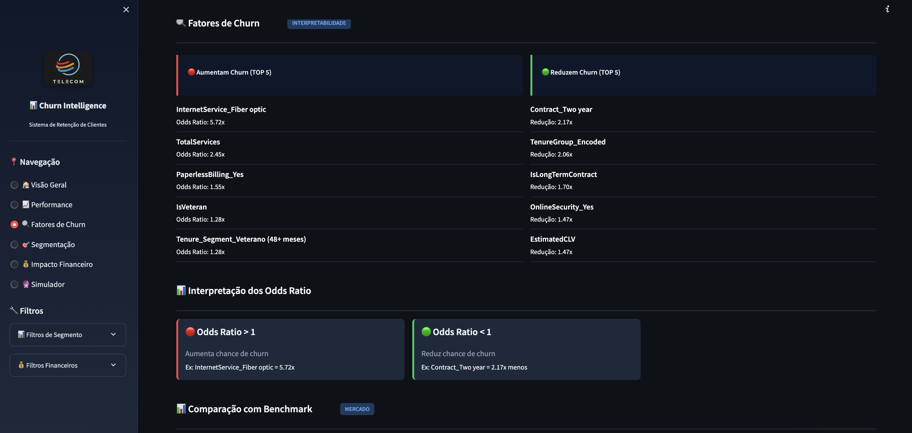
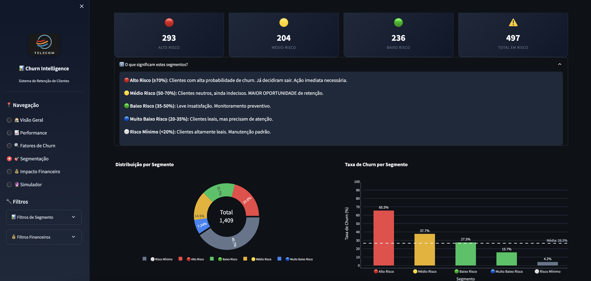
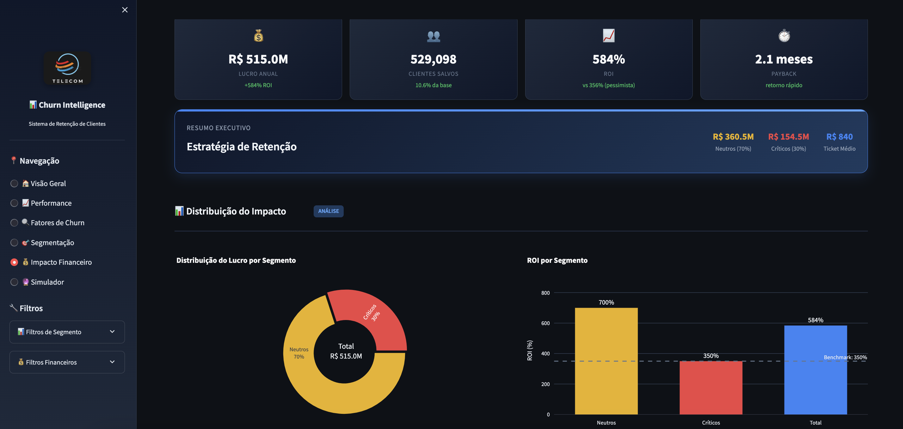
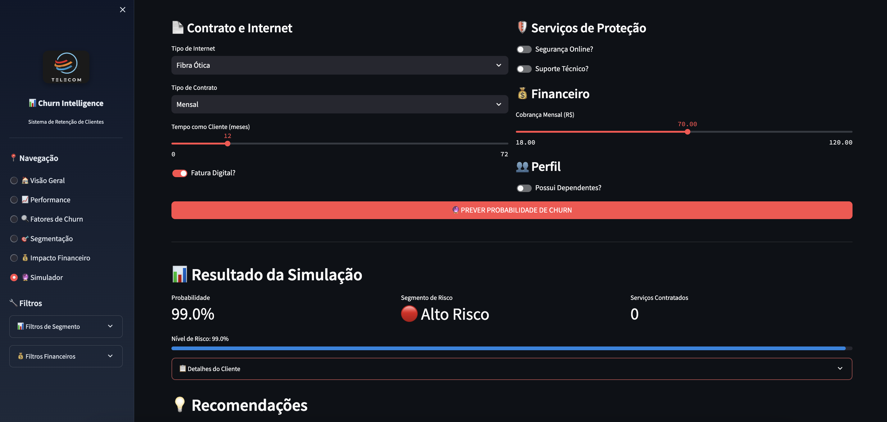

# Sistema Inteligente de Retenção de Clientes - Dashboard Executivo

      

---
## 🔍 Visão Geral 

O **Sistema Inteligente de Retenção de Clientes** é um dashboard executivo desenvolvido em Streamlit que permite a visualização interativa de métricas de churn, segmentação de risco, recomendações de ação e análise financeira para uma operadora de telecomunicações. Baseado em modelos de machine learning, o sistema identifica clientes com risco de cancelamento e fornece recomendações estratégicas para maximizar a retenção e o ROI.

---
## 🖼️ Tour pelo Dashboard

Vamos fazer um tour pelas principais telas do dashboard para que você possa entender suas funcionalidades sem precisar executá-lo.

---
### 📊 Página Inicial - Visão Geral



A página inicial apresenta os seguintes KPIs do negócio em um formato claro e conciso.

* **KPIs Principais do modelo**:

	- ROC-AUC - 0.8404
	- Recall - 71.93%
	- Precision - 54.12%
	- F1-Score - 0.6177

- **Métricas de Risco**:

	- 497 Clientes em Risco Crítico (35.3% da base)
	- $ 417,480 de Receita em Risco
	- 497 clientes Prioridade Máxima (ação imediata)

- **Resumo Financeiro**:

	- $ 840 Receita Média/Cliente
	- $ 50 Custo por Intervenção
	- 584% de ROI Projetado
	- 1.8 meses de Payback

---
### 📈 Página Performance





A página Performance apresenta filtros e visualizações do modelo, possibilitando simular diversos cenários.

- **Performance do Modelo**:
	- Filtros por segmento de risco

- **Configuração de Threshold**:
	- Threshold 0.3 (Agressivo)
	- Threshold 0.5 (Padrão)
	- Threshold 0.7 (Conservador)

- **Visualizações dinâmicas**:
	- Matriz de Confusão
	- Métricas de Classificação
	- Curva ROC
	- Curva de Calibração

---

### 🔍 Página  Fatores de Churn



Na Página Fatores de Churn, encontra-se as principais informações sobre as Features, assim como Benchmark, Insights e Recomendações.

- **Fatores de Churn**:
	- Aumentam Churn (TOP 5)
	- Reduzem Churn (TOP 5)

- **Interpretação dos Odds Ratio**:
	- Odds Ratio > 1
	- Odds Ratio < 1

- **Comparação com Benchmark**:
	- Top Fatores de Risco
	- Benchmark Indústria

- **Impacto das Features**
	- Top 15 Fatores de Churn (Coeficientes)

- **Insights Estratégicos**:
	- Fator de Maior Risco
	- Fator de Maior Proteção

- **Recomendações por Categoria**:
	- Contrato
	- Serviços
	- Financeiro

---
### 📈 Página Segmentação de Clientes



A página Segmentação de Clientes, possui visualizações que permitem identificar rapidamente quais segmentos devem ser priorizados nas ações de retenção.

- **Segmentação de Clientes**:
	- Alto Risco
	- Médio Risco
	- Baixo Risco
	- Total em Risco

- **Resumo dos Segmentos Prioritários**:
	- Clientes em Risco
	- Receita em Risco
	- Clientes Estáveis
	- Clientes Leais

- **Estratégias por Segmento**:
	- Ações

- **Matriz de Priorização**
	- Neutros com Alto Valor
	- Críticos com Alto Valor
	- Neutros com Valor Médio
	- Demais Segmentos

- **Visualizações Gráficas**:
	- Distribuição por segmento
	- Taxa de Churn por segmento
	- Distribuição de Receita por Segmento

---
### 💰 Página Impacto Financeiro



A página de recomendações apresenta a análise baseada em todos os segmentos, a distribuição do Impacto e a análise de cenários.

- **Análise baseada em todos os segmentos**:
	- 1,409 clientes analisados | 497 em risco crítico
	- Projeção para base total de 5,000,000 clientes

- **Estratégia de Retenção**

- **Distribuição do Impacto**:
	- Distribuição do Lucro por Segmento
	- ROI por Segmento

- **Análise de Cenários**:
	- Pessimista
	- Base
	- Otimista

---
### 🔮 Página do Simulador



O simulador permite testar diferentes cenários e entender como as características do cliente afetam a probabilidade de churn:

- **Seleção de Características**: 
	- Tipo de internet, contrato, tempo como cliente, serviços de proteção, etc.

- **Classificação de Risco**: 
	- Mostra o segmento em que o cliente se enquadra

- **Recomendações**: 
	- Principais ações recomendadas

- **Simulação de Mudanças**: 
	- Permite testar o impacto de diferentes intervenções

Esta ferramenta é valiosa para entender os drivers de churn e testar estratégias de mitigação.

---
## ✨ Funcionalidades

- **KPIs em Tempo Real**: Visualização das métricas-chave de negócio
- **Segmentação de Risco**: Classificação dos clientes em 5 níveis de risco
- **Playbook de Retenção**: Recomendações específicas para cada segmento
- **Análise Financeira**: Projeções de impacto financeiro das ações
- **Simulador de Churn**: Ferramenta interativa para testar cenários

---
## 🛠 Tecnologias

|Tecnologia|Uso|
|---|---|
|**Python 3.9+**|Linguagem de programação base|
|**Streamlit**|Framework para desenvolvimento da interface web interativa|
|**Pandas & NumPy**|Manipulação e análise de dados|
|**Plotly**|Visualizações interativas e responsivas|
|**Scikit-learn**|Modelos de machine learning para predição de churn|
|**JSON**|Armazenamento de configurações e playbook de retenção|
|**CSS Customizado**|Estilização avançada da interface|

## 🚀 Instalação e Execução

1. **Clone o repositório**

```bash
   git clone https://github.com/username/telco-churn-dashboard.git
   cd telco-churn-dashboard
```

2. **Instale as dependências**

```bash
   pip install -r requirements.txt
```

3. **Execute o notebook para gerar os artefatos necessários**

```bash
   jupyter notebook notebooks/05_business_insights.ipynb
```

4. **Inicie o dashboard**

```bash
   cd dashboard
   streamlit run app.py
```

5. **Acesse o dashboard**

	O aplicativo será aberto automaticamente no seu navegador padrão (geralmente em `http://localhost:8501`)

---
## 👥 Contribuições

Contribuições são bem-vindas! 

Para contribuir:

1. Faça um fork do projeto
2. Crie uma branch para sua feature (`git checkout -b feature/nova-funcionalidade`)
3. Commit suas mudanças (`git commit -m 'Adiciona nova funcionalidade'`)
4. Push para a branch (`git push origin feature/nova-funcionalidade`)
5. Abra um Pull Request

## 👤 **Autor**

**Nome:** Ivan Ajala  
**Função:** Data Scientist  
**Projeto:** Telco Customer Churn Prediction


---
## 📄 Licença

Este projeto está licenciado sob a **MIT License** - veja o arquivo [LICENSE](../LICENSE) para detalhes.

---
## 🔄 Histórico de Versões

| Versão | Data       | Descrição                                                |
| ------ | ---------- | -------------------------------------------------------- |
| 1.0    | 25/02/2026 | Atualização e revisão final (código e documentação)      |

---


**⭐ Se este projeto foi útil, considere dar uma estrela no GitHub!**

---
### 🔗 Navegação Rápida

**⬅️ [Anterior](../notebooks/05_business_insights.ipynb)** | **[🔝 Voltar ao topo](#-visão-geral)**  | **➡️ [Próximo](../README.md)**

---