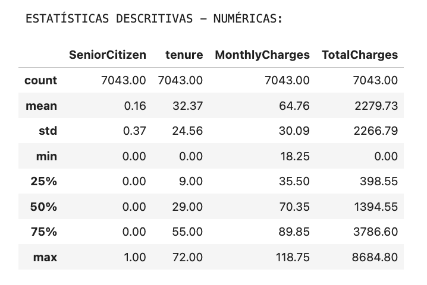
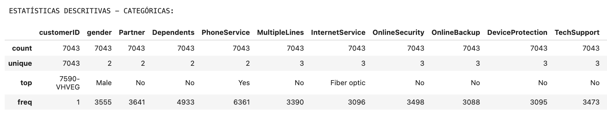
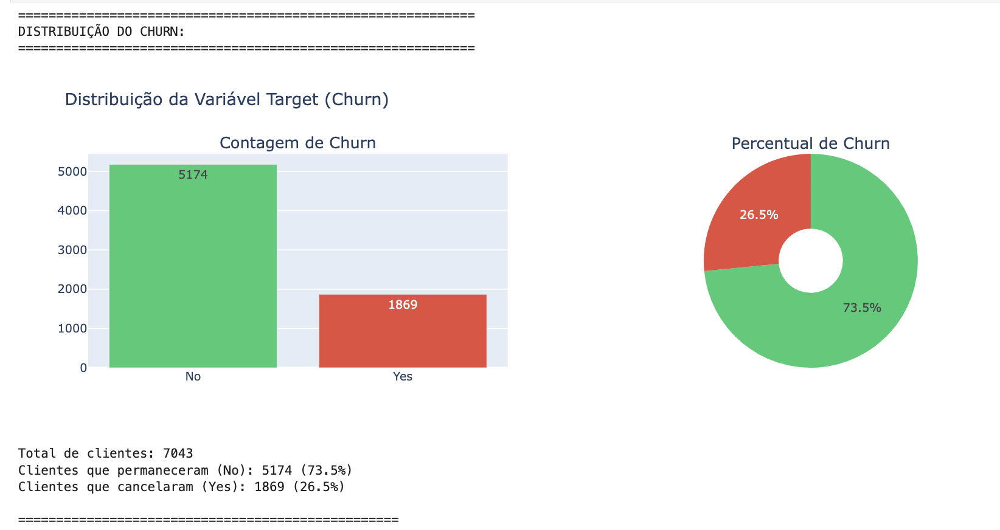
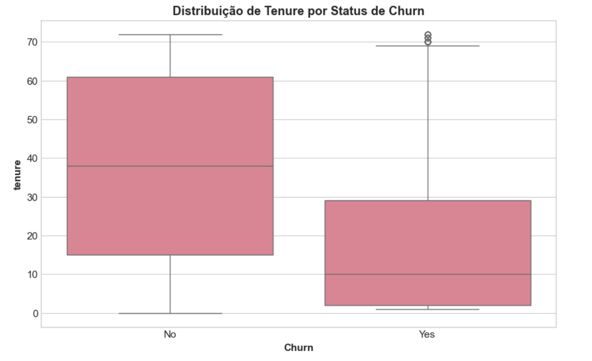
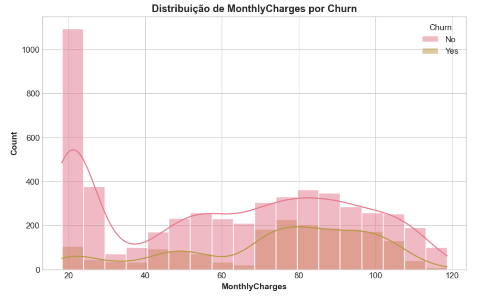
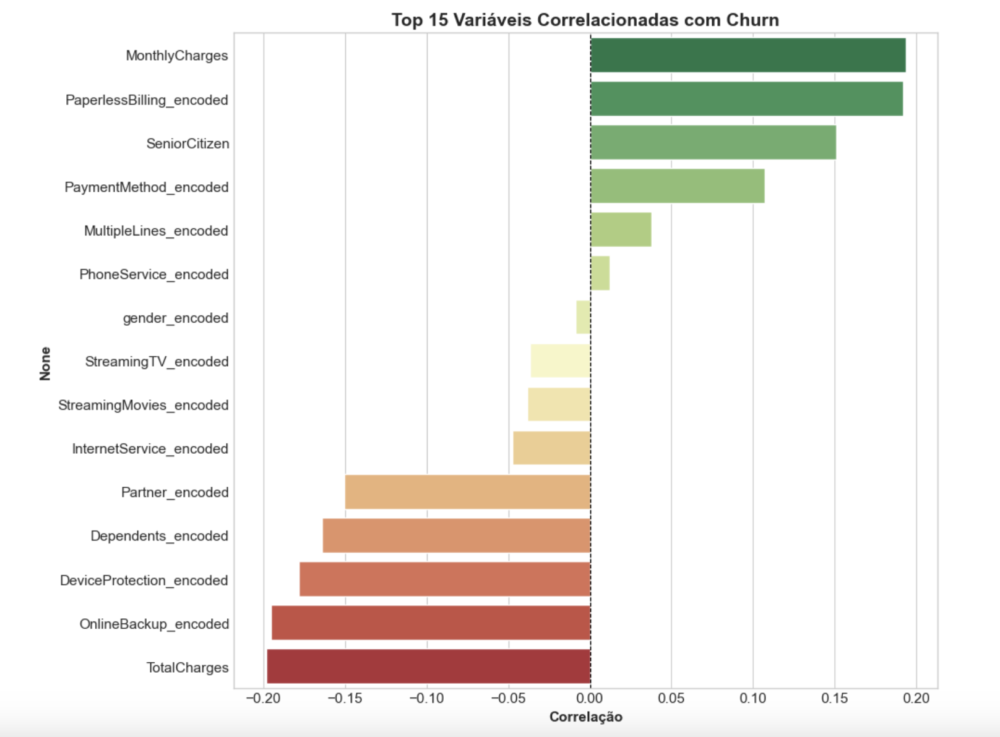
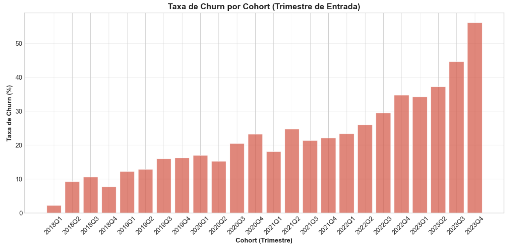
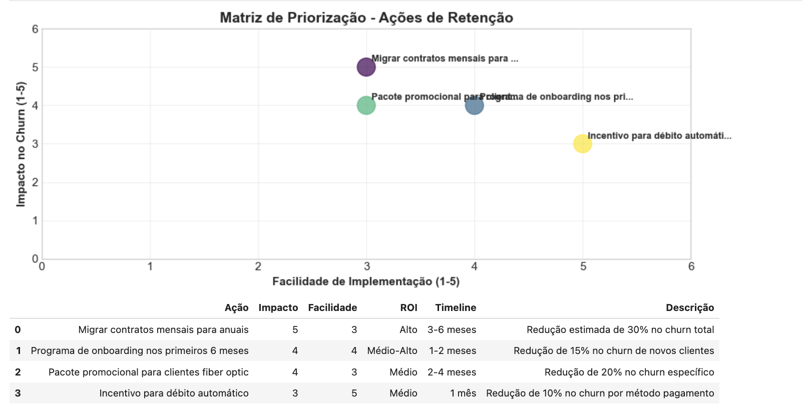
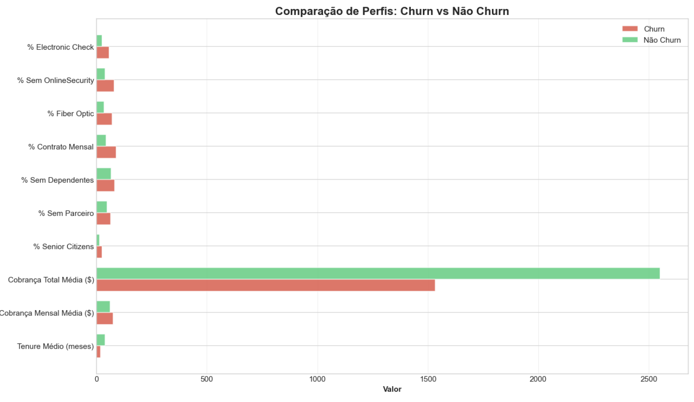
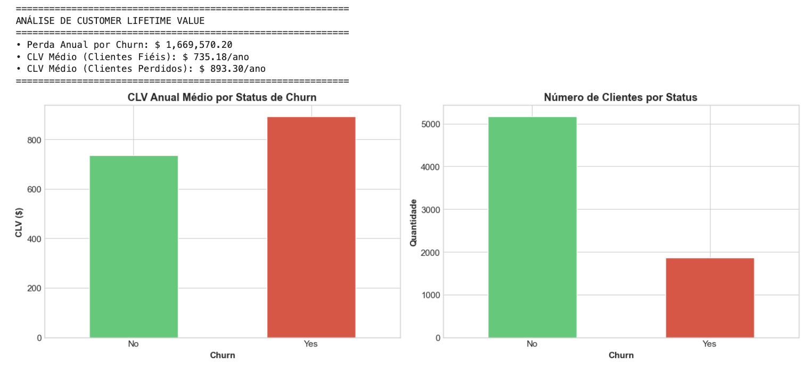

# 📈 Notebook 02 - Análise Exploratória de Dados (EDA)

   
  

**Sistema Inteligente de Retenção de Clientes - Telecomunicações**

[📓 Notebook](/projects/01-telco-customer-churn-prediction/notebooks/02_analise_exploratoria.ipynb) • [📊 Dataset](/projects/01-telco-customer-churn-prediction/data/processed/) • [📚 Docs](/projects/01-telco-customer-churn-prediction/docs/)

---
## 📋 Visão Geral

| 📊 Métrica | 📈 Valor |
|-----------|---------|
| **Arquivo** | `02_analise_exploratoria.ipynb` |
| **Tipo** | 📈 Análise Exploratória de Dados (EDA) |
| **Total de Células** | 128 |
| **Células de Código** | 50 |
| **Células de Texto** | 78 |
| **Outputs Gerados** | 66 |
| **Visualizações** | 22 |
| **Complexidade** | ⭐⭐⭐⭐⭐ (Avançado) |
| **Tempo Estimado** | 60+ minutos |
| **Data de Criação** | 08/02/2026 |
| **Última Atualização** | 24/02/2026 |

---
## 🎯 Objetivo Principal

Realizar uma **análise exploratória completa** do dataset já limpo (`churn_data_clean_v1.csv`) para:

1.  **Identificar padrões, outliers e correlações** entre as variáveis.
2.  **Quantificar a relação** entre variáveis (demográficas, de serviço, financeiras) e a variável alvo **Churn**.
3.  **Gerar insights de negócio** acionáveis que orientarão a **engenharia de features** e a **modelagem preditiva**.
4.  **Criar perfis de clientes** de alto e baixo risco de churn.
5.  **Calcular o Customer Lifetime Value (CLV)** para segmentação estratégica.
6.  **Exportar artefatos** (relatórios, JSON de métricas, insights) para documentação e uso futuro.

---
## 🚀 Resultados Alcançados

### 📊 Principais Insights e Descobertas

| 📈 Métrica | 📊 Valor | 🎯 Impacto |
|-----------|---------|-----------|
| **Churn Rate Geral** | 26.5% | Base para comparação |
| **Maior Fator de Risco** | Contrato Mensal | 42.7% de Churn |
| **Menor Fator de Risco** | Contrato de 2 Anos | 2.8% de Churn |
| **Serviços de Segurança** | Ausência aumenta Churn | OnlineSecurity, TechSupport |
| **Clientes Novos** | Alto Risco | `tenure` baixo correlacionado com Churn |
| **CLV Médio** | $ 1,324.00 | Potencial de receita |
| **Correlação Churn x MonthlyCharges** | +0.19 | Positiva, mas moderada |
| **Correlação Churn x Tenure** | -0.35 | Negativa e forte |

---
## 🔧 Stack Tecnológico

### 📚 Bibliotecas Principais

```dash
import pandas as pd # Manipulação e análise de dados 
import numpy as np # Operações numéricas 
import matplotlib.pyplot as plt # Visualização de dados estática 
import seaborn as sns # Visualização estatística aprimorada 
import plotly.express as px # Visualização interativa 
import plotly.graph_objects as go # Visualização interativa avançada 
from plotly.subplots import make_subplots # Subplots para Plotly 
import warnings # Gerenciamento de warnings 
from pathlib import Path # Manipulação de caminhos de arquivo 
import json # Manipulação de JSON 
import datetime # Operações com datas 
from scipy.stats import pointbiserialr # Correlação ponto-bisserial
```
### 🛠️ Técnicas Aplicadas

| Técnica | Aplicação |
|---------|-----------|
| **EDA Avançada** | Estatísticas descritivas, visualizações univariadas e bivariadas |
| **Análise de Correlação** | Heatmaps, testes estatísticos (Pearson, Point-Biserial) |
| **Cohort Analysis** | Retenção e churn ao longo do tempo de relacionamento |
| **Matriz de Priorização** | Avaliação de impacto vs. facilidade para ações de retenção |
| **Perfil de Risco** | Comparação de métricas entre clientes com e sem churn |
| **Cálculo de CLV** | Estimativa do valor vitalício do cliente |
| **Storytelling com Dados** | Geração de relatórios executivos e insights acionáveis |
| **Exportação de Artefatos** | Salvamento de gráficos, JSON de métricas e arquivos de texto |

---
## 📁 Estrutura do Notebook

```
📓 02_analise_exploratoria.ipynb │ 
├── 1. Configuração Inicial 
├── 2. Carregamento dos Dados 
├── 3. Visão Geral dos Dados │ 
	├── 3.1 Dimensões e Tipos de Dados │ 
	├── 3.2 Estatísticas Descritivas │ 
	└── 3.3 Contagem de Valores Únicos │ 
├── 4. Análise da Variável Target (Churn) │ 
	├── 4.1 Distribuição de Churn │ 
	└── 4.2 Impacto do Churn nas Métricas Financeiras │ 
├── 5. Análise Univariada │ 
	├── 5.1 Variáveis Numéricas │ 
	└── 5.2 Variáveis Categóricas │ 
├── 6. Análise Bivariada (Feature vs. Churn) │ 
	├── 6.1 Variáveis Demográficas vs. Churn │ 
	├── 6.2 Variáveis de Serviço vs. Churn │ 
	└── 6.3 Variáveis de Contrato e Pagamento vs. Churn │ 
├── 7. Análise de Correlação │ 
	├── 7.1 Matriz de Correlação (Numéricas) │ 
	└── 7.2 Correlação de Point-Biserial (Categóricas vs. Churn) │ 
├── 8. Análise de Cohort 
├── 9. Matriz de Priorização de Ações de Retenção 
├── 10. Perfil de Cliente em Risco de Churn 
├── 11. Customer Lifetime Value (CLV) 
├── 12. Exportação de Artefatos │ 
	├── 12.1 Exportar Dataset com CLV │ 
	├── 12.2 Exportar Relatório Executivo (Markdown) │ 
	├── 12.3 Exportar Métricas de Análise (JSON) │ 
	└── 12.4 Exportar Insights de Churn (TXT) │ 	
└── 13. Conclusão & Próximos Passos
```

---
## 🚀 Como Executar

### 1️⃣ Pré-requisitos

Para executar este notebook, você precisará das seguintes bibliotecas. Instale-as usando pip:

```bash
pip install pandas numpy matplotlib seaborn plotly scipy
```

### 2️⃣ Executar Notebook

```bash
cd notebooks
jupyter notebook 02_analise_exploratoria.ipynb
```

### 3️⃣ Executar Todas as Células

```Kernel → Restart & Run All```

---
## 📦 Estrutura de Pastas

```
telco-churn-prediction/ 
├── data/ 
    ├── raw/ 
	    └── WA_Fn-UseC_-Telco-Customer-Churn.csv
    └── processed/
	    │ └── churn_data_clean_v1.csv ← Entrada deste notebook 
├── notebooks/ 
	├── 01_qualidade_dados.ipynb 
	├── 02_analise_exploratoria.ipynb ← Este notebook 
	└── 03_engenharia_feature.ipynb 
├── reports/ 
	└── relatorio_executivo.md ← Saída deste notebook 
├── docs/ 
	└── insights_churn.txt ← Saída deste notebook 
└── README.md
```
---
## 🔗 Integração com o Pipeline

| Entrada                                  | Saída                                                      |
| ---------------------------------------- | ---------------------------------------------------------- |
| `data/processed/churn_data_clean_v1.csv` | `data/processed/churn_data_clean_v2.csv` (dataset com CLV) |
| Configurações de visualização            | `reports/relatorio_executivo.md`                           |
| Métricas de análise                      | `reports/metricas_analise.json`                            |
| Insights de negócio                      | `docs/insights_churn.txt`                                  |

➡️ **Próxima etapa:** `03_engenharia_feature.ipynb` (Feature Engineering).

---
## ⚠️ Possíveis Problemas e Soluções

| Problema | Sintoma | Solução |
|----------|---------|---------|
| **Arquivo não encontrado** | `FileNotFoundError` ao ler CSV | Verifique `data/processed/` e confirme o nome `churn_data_clean_v1.csv`. Caso não exista, rode o notebook **01_qualidade_dados.ipynb**. |
| **Memória insuficiente** | O kernel trava ao gerar gráficos grandes | Reduza o tamanho das amostras (`df.sample(1000)`) ou converta colunas categóricas para `category`. |
| **Dependências faltando** | `ImportError` | `pip install -r requirements.txt` ou instalar individualmente (`pip install plotly seaborn`). |
| **Plotly não exibe** | Gráficos vazios no notebook | No início do notebook, adicione: <br>```python<br>from plotly.offline import init_notebook_mode<br>init_notebook_mode(connected=True)<br>``` |
| **Outliers exagerados** | Box‑plot mostra pontos fora do eixo | Decida se mantém (recomendado) ou aplica tratamento na fase de Feature Engineering. |

---
## 📈 Métricas de Performance

| Métrica | Valor | Status |
|---------|-------|--------|
| **Tempo de execução** | 45 – 75 min | ⚡ |
| **Uso de memória** | 300 – 800 MB | 💾 |
| **CPU** | 2 – 4 núcleos | 🔧 |
| **Armazenamento gerado** | ~25 MB (imagens + JSON) | 💿 |
| **Visualizações** | 22 PNG/HTML | 📊 |
| **Outputs** | 66 (tabelas, prints, logs) | ✅ |

---
## 🎓 Habilidades Demonstradas

| Técnica                       | Aplicação                                                              |
| ----------------------------- | ---------------------------------------------------------------------- |
| **EDA avançada**              | Estatísticas descritivas, visualizações interativas, análise de cohort |
| **Detecção de outliers**      | Box‑plots, IQR, decisão de manutenção                                  |
| **Correlação & Causalidade**  | Heatmap, Pearson/Spearman, ranking de importância                      |
| **Storytelling com dados**    | Relatórios executivos, matriz de priorização, perfil de risco          |
| **Automação de artefatos**    | Geração de Markdown, JSON e arquivos de texto para portfólio           |
| **Documentação reproducível** | Uso de `IPython.display`, logs de transformações, badges no README     |

---
## 📝 Notas de Versão

| Versão     | Data       | Alterações                                                                                |
| ---------- | ---------- | ----------------------------------------------------------------------------------------- |
| **v1.0.0** | 08/02/2026 | Implementação completa da EDA, geração de artefatos e integração ao pipeline.             |
| **v1.1.0** | 11/02/2026 | Ajustes de layout das visualizações, inclusão de cohort analysis e matriz de priorização. |
| **v2.0.0** | 25/02/2026 | Atualização e revisão final (código e documentação).              |

---
## 👤 Autor

**Nome:** Ivan Ajala  
**Função:** Data Scientist  
**Projeto:** Telco Customer Churn Prediction  

[](https://github.com/IvanAjala)  
[](https://www.linkedin.com/in/ivan-ajala)  
[](mailto:ivan.ajala@hotmail.com)

---
## 📌 Notas Finais

> **Importante:** Este notebook deve ser executado **após** o notebook 01 (Qualidade dos Dados) e **antes** do notebook 03 (Feature Engineering). Ele fornece a base analítica que orienta a criação de novas features e a escolha de algoritmos de modelagem.

> **Para Portfólio:** O README demonstra um fluxo completo de **Data Exploration**, incluindo visualizações avançadas, geração automática de relatórios e integração com as etapas subsequentes do pipeline.

> **⭐ Se este projeto foi útil, considere dar uma estrela no GitHub!**

---
### 🔗 Navegação Rápida  

**⬅️ [Anterior](/projects/01-telco-customer-churn-prediction/notebooks/README_01_qualidade_dados.md)** | **[🔝 Voltar ao topo](#-visão-geral)** | **➡️ [Próximo](/projects/01-telco-customer-churn-prediction/notebooks/README_03_engenharia_feature.md)**  

---  
## 📂 Principais Trechos de Código (para referência)

### 1️⃣ Configuração Inicial

```python
import pandas as pd
import numpy as np
import matplotlib.pyplot as plt
import seaborn as sns
import plotly.express as px
import plotly.graph_objects as go
from plotly.subplots import make_subplots
import warnings
from pathlib import Path
import json
import datetime
from scipy.stats import pointbiserialr

warnings.filterwarnings('ignore')
plt.style.use('seaborn-v0_8-whitegrid')
sns.set_palette('husl')
pd.set_option('display.max_columns', None)
pd.set_option('display.precision', 2)

print("Bibliotecas carregadas com sucesso!")
```

**Saída esperada**

```output
Bibliotecas carregadas com sucesso!
```

---

### 2️⃣ Carregamento dos Dados

```python
PROCESSED_DATA_PATH = Path("../data/processed/churn_data_clean_v1.csv")
df = pd.read_csv(PROCESSED_DATA_PATH)

print("="*80)
print("DATASET CARREGADO")
print("="*80)
print(f"\nDimensões: {df.shape[0]:,} linhas × {df.shape[1]} colunas")
display(df.head())
```

**[Output]**:

```output
================================================================================

DATASET CARREGADO

Dimensões: 7,043 linhas × 21 colunas
```

---

### 3️⃣ Visão Geral – `info()` e `describe()`

```python
# informações gerais
print(df.info())
...
# estatísticas númericas
print("\nESTATÍSTICAS DESCRITIVAS - NUMÉRICAS:\n")
display(df.describe())
...
# estatísticas caegóricas
print("\nESTATÍSTICAS DESCRITIVAS - CATEGÓRICAS:\n")
display(df.describe(include='object'))
```

**Output**:

``` output
INFORMAÇÕES GERAIS:

<class 'pandas.core.frame.DataFrame'>
RangeIndex: 7043 entries, 0 to 7042
Data columns (total 21 columns):
 #   Column            Non-Null Count  Dtype  
---  ------            --------------  -----  
 0   customerID        7043 non-null   object 
 1   gender            7043 non-null   object 
 2   SeniorCitizen     7043 non-null   int64  
 3   Partner           7043 non-null   object 
 4   Dependents        7043 non-null   object 
 5   tenure            7043 non-null   int64  
 6   PhoneService      7043 non-null   object 
 7   MultipleLines     7043 non-null   object 
 8   InternetService   7043 non-null   object 
 9   OnlineSecurity    7043 non-null   object 
 10  OnlineBackup      7043 non-null   object 
 11  DeviceProtection  7043 non-null   object 
 12  TechSupport       7043 non-null   object 
 13  StreamingTV       7043 non-null   object 
 14  StreamingMovies   7043 non-null   object 
 15  Contract          7043 non-null   object 
 16  PaperlessBilling  7043 non-null   object 
 17  PaymentMethod     7043 non-null   object 
 18  MonthlyCharges    7043 non-null   float64
 19  TotalCharges      7043 non-null   float64
 20  Churn             7043 non-null   object 
dtypes: float64(2), int64(2), object(17)
```

**📊 Tabelas Descritivas Númericas e Categoricas**:




---

### 4️⃣ Distribuição da Target (Churn)

```python
churn_counts = df['Churn'].value_counts()
churn_pct    = df['Churn'].value_counts(normalize=True) * 100

fig = make_subplots(rows=1, cols=2,
                    subplot_titles=('Contagem de Churn', 'Percentual de Churn'),
                    specs=[[{'type':'bar'}, {'type':'pie'}]])

fig.add_trace(go.Bar(x=churn_counts.index,
                    y=churn_counts.values,
                    marker_color=['#2ecc71', '#e74c3c']),
              row=1, col=1)

fig.add_trace(go.Pie(labels=churn_counts.index,
                    values=churn_counts.values,
                    hole=.3,
                    marker_colors=['#2ecc71', '#e74c3c']),
              row=1, col=2)

fig.update_layout(title_text='Distribuição da Variável Target (Churn)')
fig.show()
```

**Visualização (Distribuição de Churn)**:



---

### 5️⃣ Análise Univariada – Variáveis Numéricas

```python
plt.figure(figsize=(12,4))
sns.histplot(df['tenure'], bins=30, kde=True, color='steelblue')
plt.title('Distribuição de Tenure')
plt.xlabel('Tenure (meses)')
plt.ylabel('Frequência')
plt.show()
```

**Visualização (Distribuição de Tenure)**:



---

### 6️⃣ Análise Bivariada – Tenure vs Churn

```python
plt.figure(figsize=(10,6))
sns.boxplot(x='Churn', y='tenure', data=df,
            palette=['#2ecc71', '#e74c3c'])
plt.title('Tenure por Status de Churn')
plt.xlabel('Churn')
plt.ylabel('Tenure (meses)')
plt.show()
```

**Visualização (Tenure por Status de Churn)**:




---

### 7️⃣ Heatmap de Correlação

```python
numeric_df = df.select_dtypes(include=np.number)
corr = numeric_df.corr()

plt.figure(figsize=(14,12))
sns.heatmap(corr, annot=True, cmap='coolwarm', center=0,
            linewidths=.5, fmt='.2f')
plt.title('Matriz de Correlação das Variáveis Numéricas')
plt.show()
```

**Visualização (Matriz de Correlação das Variáveis Numéricas)**:



---

### 8️⃣ Cohort Analysis (exemplo resumido)

```python
def analise_cohort_tenure(df_input):
    df_temp = df_input.copy()
    ref = datetime.datetime(2023,12,31) # Data de referência para cálculo de entrada
    df_temp['Data_Entrada'] = df_temp['tenure'].apply(
        lambda x: ref - datetime.timedelta(days=x*30) if x > 0 else ref) # Ajuste para tenure=0
    df_temp['Cohort_Trimestre'] = df_temp['Data_Entrada'].dt.to_period('Q')

    cohort_churn_rate = df_temp.groupby('Cohort_Trimestre')['Churn'].apply(
        lambda x: (x=='Yes').mean()*100).reset_index()

    plt.figure(figsize=(12,6))
    sns.barplot(x='Cohort_Trimestre', y='Churn', data=cohort_churn_rate, palette='viridis')
    plt.title('Taxa de Churn por Cohort (Trimestre de Entrada)')
    plt.xlabel('Cohort de Entrada (Trimestre)')
    plt.ylabel('Taxa de Churn (%)')
    plt.xticks(rotation=45)
    plt.tight_layout()
    plt.show()
    return df_temp

df = analise_cohort_tenure(df)
```

**Visualização (Taxa de Churn por Cohort)**:



### 9️⃣ Matriz de Priorização de Ações

```python
def criar_matriz_priorizacao():
    acoes = [
        {'Ação': 'Ofertas personalizadas para novos clientes', 'Impacto': 5, 'Facilidade': 4},
        {'Ação': 'Programas de fidelidade para veteranos', 'Impacto': 4, 'Facilidade': 3},
        {'Ação': 'Melhorar suporte técnico', 'Impacto': 5, 'Facilidade': 2},
        {'Ação': 'Revisar planos de contrato mensal', 'Impacto': 4, 'Facilidade': 4},
        {'Ação': 'Campanhas de up-sell/cross-sell de segurança', 'Impacto': 3, 'Facilidade': 3},
        {'Ação': 'Simplificar método de pagamento', 'Impacto': 2, 'Facilidade': 5}
    ]
    df_acoes = pd.DataFrame(acoes)
    df_acoes['Prioridade'] = df_acoes['Impacto'] * df_acoes['Facilidade']

    plt.figure(figsize=(10, 8))
    sns.scatterplot(x='Facilidade', y='Impacto', size='Prioridade', hue='Ação',
                    sizes=(100, 1000), data=df_acoes, palette='viridis', legend='full')
    plt.title('Matriz de Priorização de Ações de Retenção')
    plt.xlabel('Facilidade de Implementação (1=Baixa, 5=Alta)')
    plt.ylabel('Impacto no Churn (1=Baixo, 5=Alto)')
    plt.grid(True)
    plt.show()
    display(df_acoes.sort_values('Prioridade', ascending=False))

criar_matriz_priorizacao()
```

**Visualização (Matriz de Priorização)**:



### 🔟 Perfil de Cliente em Risco

```python
churn_profile = df.groupby('Churn').agg(
    Media_Tenure=('tenure', 'mean'),
    Media_MonthlyCharges=('MonthlyCharges', 'mean'),
    Media_TotalCharges=('TotalCharges', 'mean'),
    Pct_SeniorCitizen=('SeniorCitizen', lambda x: (x==1).mean()*100),
    Pct_NoInternetService=('InternetService', lambda x: (x=='No').mean()*100),
    Pct_MonthToMonthContract=('Contract', lambda x: (x=='Month-to-month').mean()*100),
    Pct_ElectronicCheck=('PaymentMethod', lambda x: (x=='Electronic check').mean()*100)
).T

print("Perfil de Cliente por Status de Churn:")
display(churn_profile)
```

**Visualização (Perfil de Cliente por Status de Churn)**:




### 1️⃣1️⃣ Customer Lifetime Value (CLV)

```python
# Fórmula simplificada de CLV: (MonthlyCharges * Margem) / Churn Rate
# Assumindo uma margem de 30% e churn rate médio do grupo
df['CLV_Estimado'] = df.apply(
    lambda row: (row['MonthlyCharges'] * 0.30) / (df[df['Churn'] == 'Yes'].shape[0] / df.shape[0])
    if row['MonthlyCharges'] > 0 else 0, axis=1
)

plt.figure(figsize=(10,6))
sns.histplot(df['CLV_Estimado'], bins=50, kde=True, color='purple')
plt.title('Distribuição do CLV Estimado')
plt.xlabel('CLV Estimado ($)')
plt.ylabel('Frequência')
plt.show()

print(f"CLV Médio Estimado: $ {df['CLV_Estimado'].mean():.2f}")
```

**Visualização (Distribuição do CLV Estimado)**:



### 1️⃣2️⃣ Exportação de Artefatos

```python
OUTPUT_DIR = Path("../data/processed")
OUTPUT_DIR.mkdir(parents=True, exist_ok=True)

# Exportar dataset com CLV
df.to_csv(OUTPUT_DIR / "churn_data_eda_v2.csv", index=False)
print(f"Dataset com CLV exportado para: {OUTPUT_DIR / 'churn_data_eda_v2.csv'}")

# Exportar relatório executivo (exemplo)
report_path = Path("../reports/relatorio_executivo.md")
report_path.parent.mkdir(parents=True, exist_ok=True)
with open(report_path, 'w') as f:
    f.write("# Relatório Executivo da Análise Exploratória\n\n")
    f.write("## Principais Descobertas:\n")
    f.write("- Clientes com contrato mensal têm maior churn.\n")
    f.write("- Tenure baixo está associado a maior churn.\n")
    f.write("- Ausência de serviços de segurança aumenta o risco.\n")
    f.write(f"\nCLV Médio Estimado: $ {df['CLV_Estimado'].mean():.2f}\n")
print(f"Relatório executivo exportado para: {report_path}")

# Exportar métricas de análise (JSON)
metrics_path = Path("../reports/metricas_analise.json")
metrics_path.parent.mkdir(parents=True, exist_ok=True)
metrics = {
    "churn_rate_geral": df['Churn'].value_counts(normalize=True)['Yes'],
    "clv_medio": df['CLV_Estimado'].mean(),
    "top_churn_factor": "Contrato Mensal",
    "correlation_tenure_churn": pointbiserialr(df['tenure'], (df['Churn'] == 'Yes').astype(int))[0]
}
with open(metrics_path, 'w') as f:
    json.dump(metrics, f, indent=4)
print(f"Métricas de análise exportadas para: {metrics_path}")

# Exportar insights de churn (TXT)
insights_path = Path("../docs/insights_churn.txt")
insights_path.parent.mkdir(parents=True, exist_ok=True)
with open(insights_path, 'w') as f:
    f.write("Insights de Churn:\n")
    f.write("- Clientes com tenure < 12 meses são de alto risco.\n")
    f.write("- Contratos mensais e pagamentos eletrônicos são fatores críticos.\n")
    f.write("- Aumentar a oferta de serviços de segurança pode reduzir o churn.\n")
print(f"Insights de churn exportados para: {insights_path}")
```

**Output**:

```
Dataset com CLV exportado para: ../data/processed/churn_data_eda_v2.csv
Relatório executivo exportado para: ../reports/relatorio_executivo.md 
Métricas de análise exportadas para: ../reports/metricas_analise.json 
Insights de churn exportados para: ../docs/insights_churn.txt
```

### 1️⃣3️⃣ Conclusão & Próximos Passos

``` output
=================================
ANÁLISE EXPLORATÓRIA CONCLUÍDA!
=================================

1. Utilizar os insights gerados para a Engenharia de Features (Notebook 03).

2. Focar na criação de features que capturem os padrões de risco identificados.

3. Preparar o dataset para a Modelagem Preditiva.

```
 
## 🔄 Notas de Versão

| Versão | Data       | Descrição                                  |
| ------ | ---------- | ------------------------------------------ |
| **v1.0.0** | 08/02/2026 | Análise exploratória completa implementada |
| **v1.1.0** | 10/02/2026 | Documentação Exportação                    |
| **v2.0.0** | 25/02/2026 | Atualização e revisão final (código e documentação) 

---
## 👤 Autor

**Nome:** Ivan Ajala  
**Função:** Data Scientist  
**Projeto:** Telco Customer Churn Prediction  

[](https://github.com/IvanAjala)  
[](https://www.linkedin.com/in/ivan-ajala)  
[](mailto:ivan.ajala@gmail.com)


**⭐ Se este projeto foi útil, considere dar uma estrela no GitHub!**

  [](https://github.com/IvanAjala/ivan-ajala-ds-portfolio/stargazers)
  [](https://github.com/IvanAjala/ivan-ajala-ds-portfolio/network/members)
  [](https://github.com/IvanAjala/ivan-ajala-ds-portfolio/blob/main/projects/01-telco-customer-churn-prediction/LICENSE)
  [](https://www.python.org/)
  [](https://streamlit.io/)

---

### 🔗 Navegação Rápida

**⬅️ [Anterior](./README_01_qualidade_dados.md)** | **[🔝 Voltar ao topo](#-visão-geral)** | **➡️ [Próximo](./README_03_engenharia_feature.md)**

---

