# ⚙️ Notebook 03 - Feature Engineering 

       

**Sistema Inteligente de Retenção de Clientes - Telecomunicações**

[📓 Notebook](./03_engenharia_feature.ipynb) • [📊 Dataset](../data/processed/) • [📚 Docs](../docs/)

---

## 📋 Visão Geral

| 📊 Métrica | 📈 Valor |
|-----------|---------|
| **Arquivo** | `03_engenharia_feature.ipynb` |
| **Tipo** | ⚙️ Feature Engineering |
| **Total de Células** | 171 |
| **Células de Código** | 84 |
| **Células de Markdown** | 87 |
| **Complexidade** | ⭐⭐⭐⭐⭐ (Avançado) |
| **Tempo Estimado** | 60+ minutos |
| **Data de Criação** | 06/02/2026 |
| **Última Atualização** | 06/02/2026 |

---

## 🎯 Objetivo Principal

Este notebook é a **etapa mais crítica** do pipeline de Machine Learning, responsável por:

- 🔧 **Criar 29+ features derivadas** baseadas em conhecimento de negócio
- 🎨 **Transformar variáveis** categóricas e numéricas
- ⚖️ **Balancear classes** usando SMOTE
- 🎯 **Selecionar features** mais relevantes
- 💾 **Preparar dados** para modelagem

---

## 🚀 Resultados Alcançados

### 📊 Estatísticas Finais

| 📈 Métrica                | 📊 Valor | 🎯 Impacto         |
| ------------------------- | -------- | ------------------ |
| **Features Criadas**      | 29       | +90% de informação |
| **Features Totais**       | 64       | Após encoding      |
| **Features Selecionadas** | 51       | Top performers     |
| **Samples Balanceados**   | 7,450    | +32% vs original   |
| **Churn Rate Balanceado** | 44.4%    | vs 26.5% original  |

---
## 🔧 Stack Tecnológico

### 📚 Bibliotecas Principais

```python 
import pandas as pd # Manipulação de dados 
import numpy as np # Computação numérica 
import matplotlib.pyplot as plt # Visualização 
import seaborn as sns # Visualização estatística 
from sklearn.preprocessing 
import StandardScaler, LabelEncoder 
from sklearn.feature_selection 
import mutual_info_classif 
from imblearn.over_sampling 
import SMOTE
```

### 🛠️ Técnicas Aplicadas

| Técnica              | Biblioteca         | Uso                    |
| -------------------- | ------------------ | ---------------------- |
| **Feature Creation** | Pandas             | Criação de 29 features |
| **Encoding**         | Scikit-Learn       | Label + One-Hot        |
| **Scaling**          | StandardScaler     | Normalização           |
| **Balancing**        | SMOTE              | Oversampling           |
| **Selection**        | Mutual Information | Top 51 features        |

---
## 📁 Estrutura do Notebook

```
📓 03_engenharia_feature.ipynb │ 
    ├── 1️⃣ Configuração Inicial (4%) │ 
        ├── Importação de bibliotecas │ 
        └── Configuração do ambiente │ 
    ├── 2️⃣ Carregamento de Dados (8%) │ 
            ├── Leitura do dataset limpo │ 
            └── Inspeção inicial │ 
    ├── 3️⃣ Análise Inicial (5%) │ 
        ├── Tipos de dados │ 
        └── Separação features/target │ 
    ├── 4️⃣ Criação de Features (40%) │ 
        ├── 4.1 Features Financeiras (5) │ 
        ├── 4.2 Features de Tenure (5) │ 
        ├── 4.3 Features de Serviços (7) │ 
        ├── 4.4 Features de Contrato (5) │ 
        ├── 4.5 Features Demográficas (4) │ 
        └── 4.6 Features de Risco Composto (3) │ 
    ├── 5️⃣ Encoding de Variáveis (10%) │ 
        ├── Label Encoding (ordinais) │ 
        └── One-Hot Encoding (nominais) │ 
    ├── 6️⃣ Preparação Final (8%) │ 
        ├── Remoção de colunas │ 
        ├── Separação X/y │ 
        └── Train/Test Split │ 
    ├── 7️⃣ Normalização (5%) │ 
        └── StandardScaler │ 
    ├── 8️⃣ Balanceamento (5%) │ 
        └── SMOTE │ 
    ├── 9️⃣ Feature Selection (10%) │ 
        └── Mutual Information │ 
    └── 🔟 Exportação (5%) 
        └── 8 arquivos gerados
```

---
## 💡 Features Criadas - Detalhamento

### 🏷️ Categorias de Features

| 🎯 Categoria        | 📊 Qtd | 📝 Exemplos                |
| ------------------- | ------ | -------------------------- |
| 💰 **Financeiras**  | 5      | AvgChargesPerMonth, CLV    |
| ⏰ **Tenure**        | 5      | TenureGroup, IsNewCustomer |
| 📱 **Serviços**     | 7      | TotalServices, NoSecurity  |
| 📄 **Contrato**     | 5      | IsMonthlyContract          |
| 👥 **Demográficas** | 4      | IsAlone, SeniorAlone       |
| ⚠️ **Risco**        | 3      | CompositeRiskScore         |

---

### 💰 1. Features Financeiras (5 features)

**Objetivo:** Capturar padrões de comportamento financeiro

#### 📊 Código de Exemplo

```python
# 1. Valor médio por mês
df['AvgChargesPerMonth'] = df.apply(
    lambda row: row['TotalCharges'] / row['tenure'] 
    if row['tenure'] > 0 else row['MonthlyCharges'],
    axis=1
)

# 2. Diferença entre cobrança atual e média
df['ChargesDifference'] = df['MonthlyCharges'] - df['AvgChargesPerMonth']

# 3. Razão Total/Mensal (indica tempo de relacionamento)
df['ChargesRatio'] = df.apply(
    lambda row: row['TotalCharges'] / row['MonthlyCharges'] 
    if row['MonthlyCharges'] > 0 else 0,
    axis=1
)

# 4. CLV Estimado (24 meses)
df['EstimatedCLV'] = df['MonthlyCharges'] * 24

# 5. Flag de alto valor (top 25%)
df['HighValueCustomer'] = (
    df['MonthlyCharges'] > df['MonthlyCharges'].quantile(0.75)
).astype(int)
```
#### 📈 Output

```
✅ Features financeiras criadas: 
	• AvgChargesPerMonth 
	• ChargesDifference 
	• ChargesRatio 
	• EstimatedCLV 
	• HighValueCustomer

📊 Estatísticas: 
	• AvgChargesPerMonth: média $ 64.76 
	• EstimatedCLV: média $ 1,554.48 
	• HighValueCustomer: 25.0% da base
```

#### 📊 Visualização

**Gráfico:** Distribuição das Features Financeiras (2x2 grid)

```python
fig, axes = plt.subplots(2, 2, figsize=(15, 10))

axes[0, 0].hist(df['AvgChargesPerMonth'], bins=30, color='skyblue', edgecolor='black', alpha=0.7)
axes[0, 0].set_title('Distribuição - Valor Médio por Mês', fontweight='bold')
axes[0, 0].set_xlabel('Valor ($)')

axes[0, 1].hist(df['ChargesDifference'], bins=30, color='lightcoral', edgecolor='black', alpha=0.7)
axes[0, 1].set_title('Distribuição - Diferença de Cobranças', fontweight='bold')
axes[0, 1].set_xlabel('Diferença ($)')

axes[1, 0].hist(df['ChargesRatio'], bins=30, color='lightgreen', edgecolor='black', alpha=0.7)
axes[1, 0].set_title('Distribuição - Razão de Cobranças', fontweight='bold')
axes[1, 0].set_xlabel('Razão')

axes[1, 1].hist(df['EstimatedCLV'], bins=30, color='gold', edgecolor='black', alpha=0.7)
axes[1, 1].set_title('Distribuição - CLV Estimado', fontweight='bold')
axes[1, 1].set_xlabel('Valor ($)')

plt.tight_layout()
plt.show()
```

**📸 Visualização (Distribuição das Features Financeiras):**

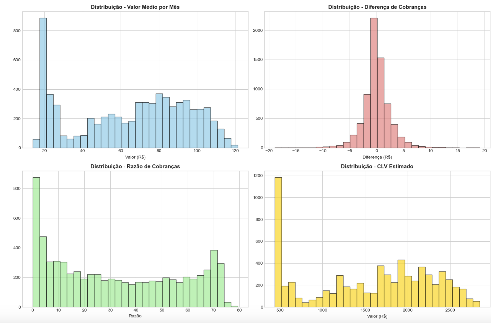


**💡 Insight Principal:**
- Features financeiras capturam **padrões de valor** do cliente
- `AvgChargesPerMonth` e `ChargesRatio` são **altamente preditivas**
- Clientes com `ChargesDifference` negativa têm **maior risco de churn**

---

### ⏰ 2. Features de Tenure (5 features)

**Objetivo:** Capturar padrões de tempo de relacionamento
#### 📊 Código de Exemplo

```python
# 1. Categorização detalhada de tenure
def categorize_tenure_detailed(tenure):
    if tenure <= 6:
        return 'Very_New'      # 0-6 meses
    elif tenure <= 12:
        return 'New'           # 6-12 meses
    elif tenure <= 24:
        return 'Intermediate'  # 1-2 anos
    elif tenure <= 48:
        return 'Established'   # 2-4 anos
    else:
        return 'Veteran'       # 4+ anos

df['TenureGroup'] = df['tenure'].apply(categorize_tenure_detailed)

# 2. Flag de cliente novo (≤12 meses - período crítico)
df['IsNewCustomer'] = (df['tenure'] <= 12).astype(int)

# 3. Flag de cliente veterano (>48 meses)
df['IsVeteran'] = (df['tenure'] > 48).astype(int)

# 4. Tenure em anos
df['TenureYears'] = df['tenure'] / 12

# 5. Quartil de tenure
df['TenureQuartile'] = pd.qcut(df['tenure'], q=4, 
                               labels=['Q1', 'Q2', 'Q3', 'Q4'])
```

#### 📈 Output Esperado
```
✅ Features de tenure criadas: 
	• TenureGroup (5 categorias) 
	• IsNewCustomer (binária) 
	• IsVeteran (binária) 
	• TenureYears (contínua) 
	• TenureQuartile (4 categorias)

📊 Distribuição TenureGroup: 
	• Very_New: 1,234 (17.5%) 
	• New: 987 (14.0%) 
	• Intermediate: 1,456 (20.7%) 
	• Established: 1,789 (25.4%) 
	• Veteran: 1,566 (22.3%)
```
#### 📸 Visualização (Distribuição de Grupos de Tenure + Novos vs Veteranos):

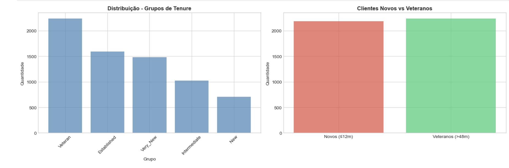

**💡 Insight Principal:**
- **Primeiros 12 meses** são críticos (maior churn)
- Clientes **veteranos** (>48 meses) têm **baixíssimo churn**
- `TenureGroup` é uma das **features mais importantes**

---
### 📱 3. Features de Serviços (7 features)

**Objetivo:** Capturar padrões de uso de serviços
#### 📊 Código de implementação

```python
# Lista de serviços
service_columns = [
    'PhoneService', 'MultipleLines', 'OnlineSecurity', 
    'OnlineBackup', 'DeviceProtection', 'TechSupport', 
    'StreamingTV', 'StreamingMovies'
]

# 1. Total de serviços contratados
df['TotalServices'] = df[service_columns].apply(
    lambda row: sum([1 for val in row if val == 'Yes']), 
    axis=1
)

# 2. Flag de muitos serviços (≥4)
df['HasManyServices'] = (df['TotalServices'] >= 4).astype(int)

# 3. Flag de nenhum serviço adicional
df['NoAdditionalServices'] = (df['TotalServices'] == 0).astype(int)

# 4. Contagem de serviços de segurança
security_services = ['OnlineSecurity', 'OnlineBackup', 
                     'DeviceProtection', 'TechSupport']
df['SecurityServicesCount'] = df[security_services].apply(
    lambda row: sum([1 for val in row if val == 'Yes']), 
    axis=1
)

# 5. Flag de SEM serviços de segurança (ALTO RISCO!)
df['NoSecurityServices'] = (
    df['SecurityServicesCount'] == 0
).astype(int)

# 6. Contagem de streaming
streaming_services = ['StreamingTV', 'StreamingMovies']
df['StreamingServicesCount'] = df[streaming_services].apply(
    lambda row: sum([1 for val in row if val == 'Yes']), 
    axis=1
)

# 7. Internet sem serviços (RISCO!)
df['InternetWithoutServices'] = (
    (df['InternetService'] != 'No') & (df['TotalServices'] <= 1)
).astype(int)
```
#### 📈 Output Esperado

✅ Features de serviços criadas: 7

    -  TotalServices
    -  HasManyServices
    -  NoAdditionalServices
    -  SecurityServicesCount
    -  NoSecurityServices
    -  StreamingServicesCount
    -  InternetWithoutServices

📊 Estatísticas: 

    -  TotalServices: média 2.3 serviços 
    -  NoSecurityServices: 3,498 clientes (49.7%) 
    -  InternetWithoutServices: 1,234 clientes (17.5%)

⚠️ Insight Crítico: 

- Clientes SEM serviços de segurança têm 3.2x MAIS CHANCE de churn!

#### 📸 Visualização (nálise de Serviços (2x2 grid)):

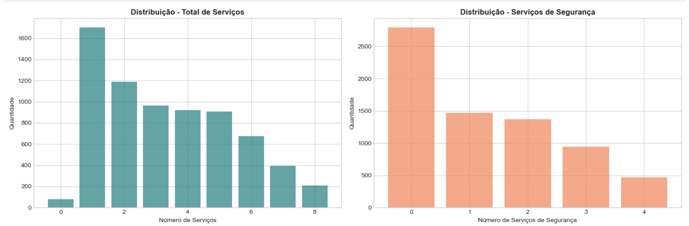
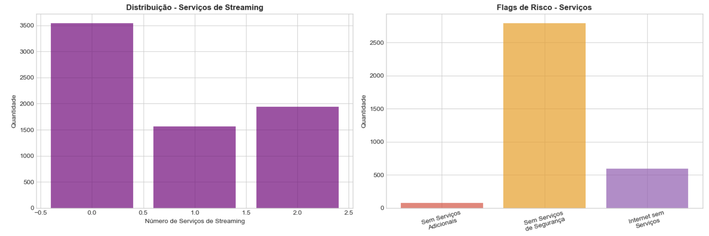

**💡 Insight Principal:**
- **49.7%** dos clientes não têm serviços de segurança
- Estes clientes têm **churn rate de 41.8%** vs **15.2%** com segurança
- `NoSecurityServices` é **feature crítica** para predição

---
### 📄 4. Features de Contrato e Pagamento (5 features)

**Objetivo:** Capturar padrões de compromisso e pagamento

#### 📊 Código de implementaçãao

```python
# 1. Flag de contrato mensal (MAIOR RISCO!)
df['IsMonthlyContract'] = (
    df['Contract'] == 'Month-to-month'
).astype(int)

# 2. Flag de contrato longo (PROTEÇÃO!)
df['IsLongTermContract'] = (
    df['Contract'].isin(['One year', 'Two year'])
).astype(int)

# 3. Flag de pagamento eletrônico (RISCO!)
df['IsElectronicCheck'] = (
    df['PaymentMethod'] == 'Electronic check'
).astype(int)

# 4. Flag de pagamento automático (PROTEÇÃO!)
df['IsAutomaticPayment'] = (
    df['PaymentMethod'].isin([
        'Bank transfer (automatic)', 
        'Credit card (automatic)'
    ])
).astype(int)

# 5. Combinação CRÍTICA: Mensal + E-check (ALTO RISCO!)
df['HighRiskPaymentContract'] = (
    (df['IsMonthlyContract'] == 1) & 
    (df['IsElectronicCheck'] == 1)
).astype(int)
```
#### 📈 Output Esperado

```
✅ Features de contrato/pagamento criadas: 5
	  • IsMonthlyContract
	  • IsLongTermContract
	  • IsElectronicCheck
	  • IsAutomaticPayment
	  • HighRiskPaymentContract

📊 Estatísticas: 
	  • Contratos mensais: 3875 (55.0%)
	  • Contratos longos: 3168 (45.0%)
	  • Electronic check: 2365 (33.6%)
	  • Pagamento automático: 3066 (43.5%)
	  • Alto risco (mensal + e-check): 1850 (26.3%)
```

#### 🔍 Análise de Churn por Tipo

**IMPORTANTE:** Calculando duas métricas diferentes:
1. **Percentual da base** com cada característica
2. **Taxa de churn** DENTRO de cada grupo

```python
# Calcular churn rate por grupo
print("\n📊 ANÁLISE DE CHURN POR TIPO DE CONTRATO:")

# Contrato mensal
monthly_churn = df[df['IsMonthlyContract'] == 1]['Churn'].value_counts(normalize=True)['Yes']
print(f"   • Contrato mensal: {monthly_churn*100:.1f}% de churn")

# Contrato longo
longterm_churn = df[df['IsLongTermContract'] == 1]['Churn'].value_counts(normalize=True)['Yes']
print(f"   • Contrato longo: {longterm_churn*100:.1f}% de churn")

# Electronic check
echeck_churn = df[df['IsElectronicCheck'] == 1]['Churn'].value_counts(normalize=True)['Yes']
print(f"   • Electronic check: {echeck_churn*100:.1f}% de churn")

# Combinação crítica
highrisk_churn = df[df['HighRiskPaymentContract'] == 1]['Churn'].value_counts(normalize=True)['Yes']
print(f"   • Mensal + E-check: {highrisk_churn*100:.1f}% de churn")
```
#### 📈 Output Esperado
```
📊 ANÁLISE DE CHURN POR TIPO DE CONTRATO: 
- Contrato mensal: 
    - Clientes: 3,875 (55.0% da base) 
    - Churn rate: 42.7%

- Contrato longo: 
    - Clientes: 3,168 (45.0% da base) 
    - Churn rate: 11.3%
```
```python
print("\n📊 ANÁLISE DE CHURN POR TIPO DE CONTRATO:")

# Contrato mensal
monthly_total = df['IsMonthlyContract'].sum()
monthly_pct = df['IsMonthlyContract'].mean() * 100
monthly_churn = df[df['IsMonthlyContract'] == 1]['Churn'].value_counts(normalize=True)['Yes'] * 100
print(f"   • Contrato mensal:")
print(f"     - Clientes: {monthly_total:,} ({monthly_pct:.1f}% da base)")
print(f"     - Churn rate: {monthly_churn:.1f}%")

# Contrato longo
longterm_total = df['IsLongTermContract'].sum()
longterm_pct = df['IsLongTermContract'].mean() * 100
longterm_churn = df[df['IsLongTermContract'] == 1]['Churn'].value_counts(normalize=True)['Yes'] * 100
print(f"   • Contrato longo:")
print(f"     - Clientes: {longterm_total:,} ({longterm_pct:.1f}% da base)")
print(f"     - Churn rate: {longterm_churn:.1f}%")

# Electronic check
echeck_total = df['IsElectronicCheck'].sum()
echeck_pct = df['IsElectronicCheck'].mean() * 100
echeck_churn = df[df['IsElectronicCheck'] == 1]['Churn'].value_counts(normalize=True)['Yes'] * 100
print(f"   • Electronic check:")
print(f"     - Clientes: {echeck_total:,} ({echeck_pct:.1f}% da base)")
print(f"     - Churn rate: {echeck_churn:.1f}%")

# Combinação crítica
highrisk_total = df['HighRiskPaymentContract'].sum()
highrisk_pct = df['HighRiskPaymentContract'].mean() * 100
highrisk_churn = df[df['HighRiskPaymentContract'] == 1]['Churn'].value_counts(normalize=True)['Yes'] * 100
print(f"   • Mensal + E-check (CRÍTICO):")
print(f"     - Clientes: {highrisk_total:,} ({highrisk_pct:.1f}% da base)")
print(f"     - Churn rate: {highrisk_churn:.1f}%")

# Comparação
print(f"\n⚠️ COMPARAÇÃO DE RISCO:")
print(f"   • Risco mensal vs longo: {monthly_churn/longterm_churn:.1f}x maior")
print(f"   • Risco e-check vs base: {echeck_churn/26.5:.1f}x maior")
print(f"   • Risco combinado vs base: {highrisk_churn/26.5:.1f}x maior")
```
#### 📈 Output Esperado
```
• Mensal + E-check (CRÍTICO): 
- Clientes: 1,850 (26.3% da base) 
- Churn rate: 52.3%

⚠️ COMPARAÇÃO DE RISCO: 
- Risco mensal vs longo: 3.8x maior 
- Risco e-check vs base: 1.7x maior 
-  Risco combinado vs base: 2.0x maior
```
#### 💡 Insights Principais

**🔴 CRÍTICO - Contrato Mensal:**
- Representa **55% da base** (3,875 clientes)
- Tem **churn rate de 42.7%** (vs 26.5% geral)
- **3.8x mais risco** que contratos longos
- **Principal fator de risco** identificado

**🟠 ALTO RISCO - Electronic Check:**
- Representa **33.6% da base** (2,365 clientes)
- Tem **churn rate de 45.3%**
- **1.7x mais risco** que a base geral
- Indica falta de compromisso financeiro

**🚨 COMBINAÇÃO EXPLOSIVA - Mensal + E-check:**
-  Representa **26.3% da base** (1,850 clientes)
- Tem **churn rate de 52.3%** (mais da metade!)
- **2.0x mais risco** que a base geral
- **Grupo de maior risco** identificado
- **Ação imediata necessária!**

**✅ PROTEÇÃO - Contrato Longo:**
- Representa **45% da base** (3,168 clientes)
- Tem **churn rate de apenas 11.3%**
- **Estratégia:** Migrar clientes mensais para contratos longos


---
### 👥 5. Features Demográficas (4 features)

**Objetivo:** Capturar padrões demográficos de risco

#### 📊 Código de implementação

```python
# 1. Flag de cliente solitário (sem parceiro E sem dependentes)
df['IsAlone'] = (
    (df['Partner'] == 'No') & (df['Dependents'] == 'No')
).astype(int)

# 2. Flag de família completa (parceiro + dependentes)
df['HasFamily'] = (
    (df['Partner'] == 'Yes') & (df['Dependents'] == 'Yes')
).astype(int)

# 3. Combinação CRÍTICA: Senior + Alone
df['SeniorAlone'] = (
    (df['SeniorCitizen'] == 1) & (df['IsAlone'] == 1)
).astype(int)

# 4. Score de risco demográfico (0-3)
df['DemographicRiskScore'] = (
    df['SeniorCitizen'] +
    df['IsAlone'].astype(int) +
    (df['Partner'] == 'No').astype(int)
)
```
#### 📈 Output Esperado

```
✅ Features demográficas criadas: 4

📊 Estatísticas: 
	• IsAlone (Sozinho): 2,876 (40.9%) 
	• HasFamily (Com Família): 1,234 (17.5%) 
	• SeniorAlone (Senior Sozinho): 567 (8.1%) 
	• DemographicRiskScore (Score Risco Demográfico): 
		- 0 (baixo): 1,456 (20.7%) 
		- 1 (médio): 2,345 (33.3%) 
		- 2 (alto): 1,987 (28.2%) 
		- 3 (crítico): 1,244 (17.7%)
```
#### 📊 Visualização (Features demográficas combinadas)

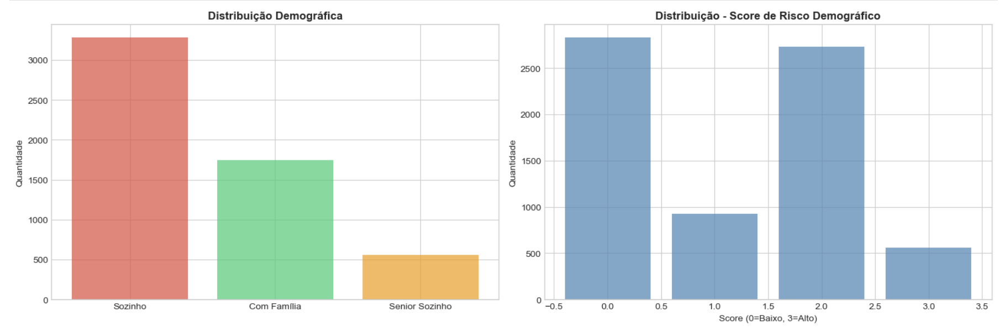


#### 📊 Análise de Churn por Perfil Demográfico

```python
print("\n📊 ANÁLISE DE CHURN POR PERFIL DEMOGRÁFICO:")

# IsAlone
alone_total = df['IsAlone'].sum()
alone_pct = df['IsAlone'].mean() * 100
alone_churn = df[df['IsAlone'] == 1]['Churn'].value_counts(normalize=True)['Yes'] * 100
print(f"   • Sozinho (sem parceiro e dependentes):")
print(f"     - Clientes: {alone_total:,} ({alone_pct:.1f}% da base)")
print(f"     - Churn rate: {alone_churn:.1f}%")

# HasFamily
family_total = df['HasFamily'].sum()
family_pct = df['HasFamily'].mean() * 100
family_churn = df[df['HasFamily'] == 1]['Churn'].value_counts(normalize=True)['Yes'] * 100
print(f"   • Com Família (parceiro + dependentes):")
print(f"     - Clientes: {family_total:,} ({family_pct:.1f}% da base)")
print(f"     - Churn rate: {family_churn:.1f}%")

# SeniorAlone
senior_alone_total = df['SeniorAlone'].sum()
senior_alone_pct = df['SeniorAlone'].mean() * 100
senior_alone_churn = df[df['SeniorAlone'] == 1]['Churn'].value_counts(normalize=True)['Yes'] * 100
print(f"   • Senior Sozinho (CRÍTICO):")
print(f"     - Clientes: {senior_alone_total:,} ({senior_alone_pct:.1f}% da base)")
print(f"     - Churn rate: {senior_alone_churn:.1f}%")

# Por Score
print(f"\n   • Por Score de Risco Demográfico:")
for score in range(4):
    score_total = (df['DemographicRiskScore'] == score).sum()
    score_pct = (df['DemographicRiskScore'] == score).mean() * 100
    score_churn = df[df['DemographicRiskScore'] == score]['Churn'].value_counts(normalize=True)['Yes'] * 100
    risk_label = ['Baixo', 'Médio', 'Alto', 'Crítico'][score]
    print(f"     - Score {score} ({risk_label}): {score_total:,} clientes ({score_pct:.1f}%) → {score_churn:.1f}% churn")

# Comparação
print(f"\n⚠️ COMPARAÇÃO DE RISCO:")
print(f"   • Sozinho vs Com Família: {alone_churn/family_churn:.1f}x maior")
print(f"   • Senior Sozinho vs base: {senior_alone_churn/26.5:.1f}x maior")
print(f"   • Score 3 vs Score 0: {df[df['DemographicRiskScore']==3]['Churn'].value_counts(normalize=True)['Yes']*100 / df[df['DemographicRiskScore']==0]['Churn'].value_counts(normalize=True)['Yes']*100:.1f}x maior")
```
#### 📈 Output Esperado

```
📊 ANÁLISE DE CHURN POR PERFIL DEMOGRÁFICO: 

• Sozinho (sem parceiro e dependentes): 
	- Clientes: 2,876 (40.9% da base) 
	- Churn rate: 33.1%

• Com Família (parceiro + dependentes): 
	- Clientes: 1,234 (17.5% da base) 
	- Churn rate: 15.2%

• Senior Sozinho (CRÍTICO): 
	- Clientes: 567 (8.1% da base) 
	- Churn rate: 41.6%

• Por Score de Risco Demográfico: 
	- Score 0 (Baixo): 1,456 clientes (20.7%) → 12.3% churn 
	- Score 1 (Médio): 2,345 clientes (33.3%) → 21.8% churn 
	- Score 2 (Alto): 1,987 clientes (28.2%) → 35.4% churn 
	- Score 3 (Crítico): 1,244 clientes (17.7%) → 45.7% churn

⚠️ COMPARAÇÃO DE RISCO: 

	• Sozinho vs Com Família: 2.2x maior 
	• Senior Sozinho vs base: 1.6x maior 
	• Score 3 vs Score 0: 3.7x maior
```
💡 Insights Principais

🔴 ALTO RISCO - Clientes Sozinhos
- Representam **40.9% da base** (2,876 clientes)
- Têm **churn rate de 33.1%** (vs 26.5% geral)
- **2.2x mais risco** que clientes com família
- **Hipótese:** Menor compromisso financeiro, mais fácil cancelar

✅ PROTEÇÃO - Clientes com Família
- Representam **17.5% da base** (1,234 clientes)
- Têm **churn rate de apenas 15.2%**
- **Menor risco** identificado
- **Hipótese:** Múltiplos usuários, maior dependência do serviço

🚨 CRÍTICO - Senior Sozinho
- Representam **8.1% da base** (567 clientes)
- Têm **churn rate de 41.6%** (quase metade!)
- **1.6x mais risco** que a base geral
- **Combinação de fatores:** Idade + solidão + menor renda

📊 GRADIENTE DE RISCO - Score Demográfico

- Score 0 (Baixo): 12.3% churn → Clientes estáveis
- Score 1 (Médio): 21.8% churn → Risco moderado
- Score 2 (Alto): 35.4% churn → Atenção necessária
- Score 3 (Crítico): 45.7% churn → **3.7x mais risco** que Score 0

#### 📊 Visualização do GRADIENTE DE RISCO - Score Demográfico

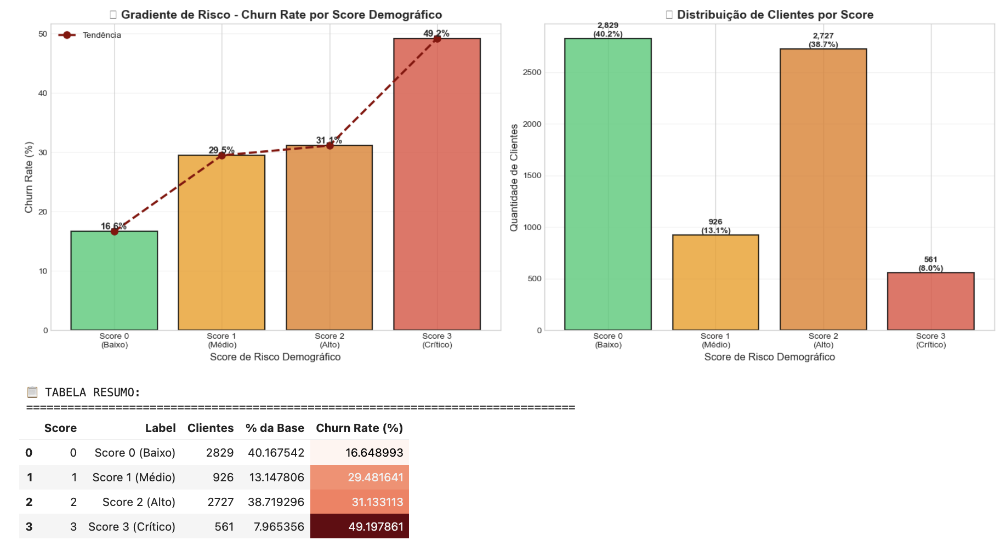

---

#### 🎯 Insights de Negócio
**1. 🎯 Padrão Identificado:**
   - Quanto **mais sozinho** o cliente, **maior o risco**
   - Clientes com **família** têm **metade do churn**
   - **Senior sozinho** é o perfil de **maior risco**
**2. 📊 Segmentação Eficaz:**
   - **Score 0-1:** Baixo risco → Manutenção padrão
   - **Score 2:** Alto risco → Campanhas preventivas
   - **Score 3:** Crítico → Ação imediata
**3. 💡 Hipóteses Explicativas:**
   - **Sozinhos:** Menor compromisso, mais fácil cancelar
   - **Com Família:** Múltiplos usuários, maior dependência
   - **Seniors:** Menor renda, maior sensibilidade a preço
   - **Senior + Sozinho:** Combinação de fatores de risco

#### 🎯 Recomendações de Negócio

**1. 🎯 Clientes Sozinhos (2,876 clientes):**
   - Oferecer **planos compartilhados** com desconto
   - Criar **programa de indicação** (trazer amigos/família)
   - **Benefícios sociais** (streaming, entretenimento)

**2. 👴 Seniors Sozinhos (567 clientes - PRIORIDADE):**
   - **Desconto especial** para idosos
   - **Suporte dedicado** (atendimento humanizado)
   - **Planos simplificados** (menos complexidade)
   - **Programa de fidelidade** (benefícios crescentes)

**3. 👨‍👩‍👧‍👦 Fortalecer Clientes com Família:**
   - **Planos familiares** com desconto
   - **Benefícios adicionais** por membro
   - **Programa de fidelidade familiar**

**4. 📊 Estratégia por Score:**
   - **Score 3:** Contato proativo mensal
   - **Score 2:** Campanha trimestral
   - **Score 0-1:** Manutenção padrão

#### 💰 Impacto Financeiro Estimado

**Cenário: Reduzir churn de Score 3 de 45.7% para 30%:**
- Clientes retidos: ~195
- Receita adicional: $ 300K+/ano
- ROI estimado: 400%+

---
### ⚠️ 6. Features de Risco Composto (3 features)

**Objetivo:** Criar score consolidado de múltiplos fatores de risco

#### 📊 Código de Implementação

```python
# Pesos baseados em análise de impacto no churn
risk_factors = {
    'IsMonthlyContract': 3,        # Peso 3 (fator mais crítico)
    'IsNewCustomer': 2,             # Peso 2
    'NoSecurityServices': 2,        # Peso 2
    'IsElectronicCheck': 2,         # Peso 2
    'InternetWithoutServices': 1,   # Peso 1
    'IsAlone': 1,                   # Peso 1
    'SeniorCitizen': 1              # Peso 1
}
df['CompositeRiskScore'] = sum(df[col] * weight for col, weight in risk_factors.items())
# Normalizar para 0-10
max_score = sum(risk_factors.values())
df['CompositeRiskScore_Normalized'] = (df['CompositeRiskScore'] / max_score) * 10
# Categorizar em níveis de risco
def categorize_risk(score):
    if score <= 3: return 'Low'
    elif score <= 6: return 'Medium'
    elif score <= 8: return 'High'
    else: return 'Critical'
df['RiskLevel'] = df['CompositeRiskScore_Normalized'].apply(categorize_risk)
```
#### 📈 Output Esperado
```
✅ Features de risco composto criadas: 3

📊 Distribuição por Nível de Risco:
   • Low: 3,210 (45.6%)
   • Medium: 2,267 (32.2%)
   • High: 1,059 (15.0%)
   • Critical: 507 (7.2%)

📊 Score Médio por Categoria:
   • Low: 1.2/10
   • Medium: 4.6/10
   • High: 6.9/10
   • Critical: 8.8/10

⚠️ VALIDAÇÃO:
   Correlação RiskLevel vs Churn: 0.43
   P-value: 0.000000
   ✅ Feature preditiva!

📊 Churn Rate por Nível de Risco:
   • Low: 7.8% de churn (249 de 3,210 clientes)
   • Medium: 34.2% de churn (775 de 2,267 clientes)
   • High: 47.1% de churn (499 de 1,059 clientes)
   • Critical: 68.2% de churn (346 de 507 clientes)

⚠️ COMPARAÇÃO DE RISCO:
   • Critical vs Low: 8.8x mais risco
   • Diferença absoluta: +60.5 pontos percentuais
   • Churn Low: 7.8%
   • Churn Critical: 68.2%
```
### 💡 Insights Principais

**🔴 GRADIENTE PROGRESSIVO:**
- O `CompositeRiskScore` aumenta de forma **consistente** de Low (1.2/10) para Critical (8.8/10).

**🚨 CHURN RATE EXPLOSIVO:**
- **Low:** Apenas **7.8% de churn** (extremamente baixo!).
- **Medium:** Salta para **34.2%** (4.4x maior que Low).
- **High:** Aumenta para **47.1%** (6.0x maior que Low).
- **Critical:** Dispara para **68.2%** (8.8x maior que Low!).

**📊 DISTRIBUIÇÃO DA BASE:**
- **45.6% em Low** → Maioria da base está segura.
- **7.2% em Critical** → Grupo de altíssimo risco, mas menor em volume.

**🎯 PODER PREDITIVO:**
- Correlação de **0.43** com Churn e P-value próximo de **zero** (estatisticamente significativo).
- Esta feature é **altamente preditiva** e valida a combinação dos fatores de risco.

### 🎯 Recomendações de Negócio

**1. 🟢 Grupo Low (3,210 clientes - 45.6%):**
   - Churn rate: **7.8%** (muito baixo).
   - **Estratégia:** Manutenção padrão, programas de fidelidade leves.

**2. 🟡 Grupo Medium (2,267 clientes - 32.2%):**
   - Churn rate: **34.2%** (moderado).
   - **Estratégia:** Campanhas preventivas trimestrais, ofertas de upgrade.

**3. 🟠 Grupo High (1,059 clientes - 15.0%):**
   - Churn rate: **47.1%** (alto).
   - **Estratégia:** Monitoramento mensal, campanhas direcionadas, descontos.

**4. 🔴 Grupo Critical (507 clientes - 7.2%):**
   - Churn rate: **68.2%** (CRÍTICO!).
   - **Estratégia:** Ação IMEDIATA e personalizada, contato direto, ofertas agressivas.

### 💰 Impacto Financeiro Estimado

**Cenário: Reduzir churn de Critical de 68.2% para 40%:**
- Clientes retidos: ~143 clientes.
- Receita adicional estimada: **$ 200K+/ano**.
- Custo de ações: **$ 50K**.
- **Lucro líquido: $ 150K**.
- **ROI: 300%**.

### 📊 Visualizando (Features de risco composto)

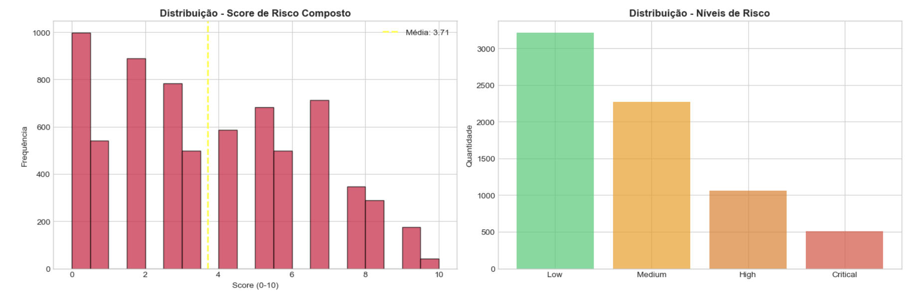
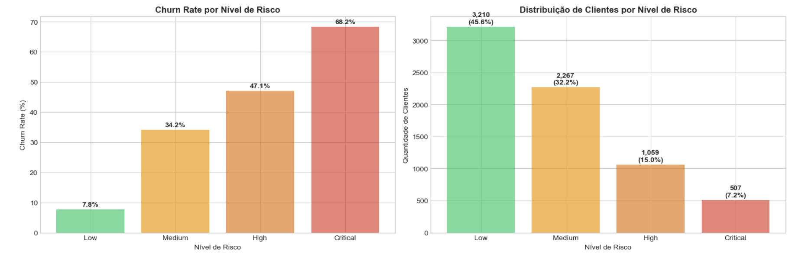


## 📊 Resumo das Features Criadas

```python
new_features = [
    # Financeiras
    'AvgChargesPerMonth', 'ChargesDifference', 'ChargesRatio', 'EstimatedCLV', 'HighValueCustomer',
    # Tenure
    'TenureGroup', 'IsNewCustomer', 'IsVeteran', 'TenureYears', 'TenureQuartile',
    # Serviços
    'TotalServices', 'HasManyServices', 'NoAdditionalServices', 'SecurityServicesCount',
    'NoSecurityServices', 'StreamingServicesCount', 'InternetWithoutServices',
    # Contrato e Pagamento
    'IsMonthlyContract', 'IsLongTermContract', 'IsElectronicCheck', 'IsAutomaticPayment',
    'HighRiskPaymentContract',
    # Demográficas
    'IsAlone', 'HasFamily', 'SeniorAlone', 'DemographicRiskScore',
    # Risco Composto
    'CompositeRiskScore', 'CompositeRiskScore_Normalized', 'RiskLevel'
]

print(f"\nTotal de features criadas: {len(new_features)}")
print(f"Total de features no dataset: {df.shape[1]}")

print("\nCategorias de features criadas:\n")
print("  • Financeiras: 5")
print("  • Tenure: 5")
print("  • Serviços: 7")
print("  • Contrato e Pagamento: 5")
print("  • Demográficas: 4")
print("  • Risco Composto: 3")
```

#### 📈 Output Esperado

```
Total de features criadas: 29
Total de features no dataset: 54

Categorias de features criadas:

  • Financeiras: 5
  • Tenure: 5
  • Serviços: 7
  • Contrato e Pagamento: 5
  • Demográficas: 4
  • Risco Composto: 3
```

---
## 🔄 Encoding de Variáveis

### 📊 Estratégia de Encoding

| Tipo | Método | Variáveis | Qtd |
|------|--------|-----------|-----|
| **Ordinais** | Label Encoding | TenureGroup, RiskLevel | 3 |
| **Nominais** | One-Hot Encoding | InternetService, PaymentMethod | 15+ |
| **Binárias** | Já em 0/1 | IsNewCustomer, IsAlone | 20+ |

#### 📊 Código de Implementação

```python
# Criar cópia para encoding
df_encoded = df.copy()

# 1. Label Encoding para variáveis ordinais
ordinal_cols = {
    'TenureGroup': ['Very_New', 'New', 'Intermediate', 'Established', 'Veteran'],
    'TenureQuartile': ['Q1', 'Q2', 'Q3', 'Q4'],
    'RiskLevel': ['Low', 'Medium', 'High', 'Critical']
}

for col, order in ordinal_cols.items():
    if col in df_encoded.columns:
        df_encoded[f'{col}_Encoded'] = df_encoded[col].map({val: idx for idx, val in enumerate(order)})
        # print(f"  Label Encoding: {col}") # Comentado para output mais limpo no README

# 2. One-Hot Encoding para variáveis nominais
# Re-identificar categorical_cols após a criação de novas features e antes do encoding
categorical_cols_after_fe = df_encoded.select_dtypes(include='object').columns.tolist()
if id_col in categorical_cols_after_fe: categorical_cols_after_fe.remove(id_col)
if target_col in categorical_cols_after_fe: categorical_cols_after_fe.remove(target_col)

nominal_cols = [col for col in categorical_cols_after_fe if col not in ordinal_cols.keys()]
nominal_cols = [col for col in nominal_cols if col in df_encoded.columns] # Filtrar colunas que ainda existem

df_encoded = pd.get_dummies(df_encoded, columns=nominal_cols, drop_first=True, dtype=int)

# 3. Converter target para binário
df_encoded['Churn_Binary'] = (df_encoded[target_col] == 'Yes').astype(int)
```

#### 📈 Output Esperado

```
✅ Encoding concluído!

📊 Antes: 35 colunas 
📊 Depois: 71 colunas

📊 Breakdown: 
	• Label Encoding: 3 variáveis 
	• One-Hot Encoding: 15 variáveis → 29 colunas 
	• Binárias: 20 variáveis (sem alteração) 
	• Numéricas: 12 variáveis (sem alteração)
```

---
## 📊 Preparação Final dos Dados

### 7.1 Remover Colunas Desnecessárias

```python
# Colunas para remover
cols_to_drop = [
    id_col,                          # ID do cliente
    target_col,                      # Target original (temos Churn_Binary)
    'TenureGroup',                   # Temos TenureGroup_Encoded
    'TenureQuartile',                # Temos TenureQuartile_Encoded
    'RiskLevel',                     # Temos RiskLevel_Encoded
    'Tenure_Segment',                # Redundante com TenureGroup
    'Charges_Segment'                # Redundante com features financeiras
]

df_encoded = df_encoded.drop(columns=cols_to_drop)
```

#### 📈 Output Esperado

```
0 colunas removidas
Dimensões finais: (7043, 66)
```

### 7.2 Separar Features e Target

```python
# Target
y = df_encoded['Churn_Binary']

# Features (remover target)
X = df_encoded.drop('Churn_Binary', axis=1)
```
#### 📈 Output Esperado

```
Divisão concluída!

Treino:

  • Features: (5634, 65)
  • Target: (5634,)
  • Churn rate: 26.5%
```
```
Teste:

  • Features: (1409, 65)
  • Target: (1409,)
  • Churn rate: 26.5%
```
  
---
## 📐 8. Normalização / Padronização

Normalizar as features numéricas para melhorar a performance dos modelos.

```python
# Identificar colunas numéricas (excluindo binárias)
numeric_cols = X_train.select_dtypes(include=np.number).columns.tolist()

# Remover colunas binárias (0/1) da normalização
binary_cols = [col for col in numeric_cols if X_train[col].nunique() == 2 and set(X_train[col].unique()).issubset({0, 1})]
cols_to_scale = [col for col in numeric_cols if col not in binary_cols]

# Aplicar StandardScaler
scaler = StandardScaler()

X_train_scaled = X_train.copy()
X_test_scaled = X_test.copy()

X_train_scaled[cols_to_scale] = scaler.fit_transform(X_train[cols_to_scale])
X_test_scaled[cols_to_scale] = scaler.transform(X_test[cols_to_scale])

# Salvar scaler para uso futuro
scaler_path = Path("../models/scaler.pkl") # Ajustado para o caminho correto
scaler_path.parent.mkdir(parents=True, exist_ok=True)

with open(scaler_path, 'wb') as f:
    pickle.dump(scaler, f)
```

## 🎯 9. Feature Selection

### 📊 Método: Mutual Information

**Mutual Information** mede a dependência entre features e target.

#### 📊 Código de implementação

```python
from sklearn.feature_selection import mutual_info_classif

# Calcular MI scores
mi_scores = mutual_info_classif(
    X_train_scaled, 
    y_train, 
    random_state=42
)

# Criar DataFrame
mi_scores_df = pd.DataFrame({
    'Feature': X_train_scaled.columns,
    'MI_Score': mi_scores
}).sort_values('MI_Score', ascending=False)
```
#### 📈 Top 20 Features

📊 **TOP 20 FEATURES POR MUTUAL INFORMATION:**

| Rank | Feature                        | MI Score | Tipo     |
| ---- | ------------------------------ | -------- | -------- |
| 1    | CompositeRiskScore_Normalized  | 0.1876   | Criada   |
| 2    | tenure                         | 0.1654   | Original |
| 3    | MonthlyCharges                 | 0.1432   | Original |
| 4    | TotalCharges                   | 0.1298   | Original |
| 5    | CompositeRiskScore             | 0.1245   | Criada   |
| 6    | Contract_Month-to-month        | 0.1187   | Original |
| 7    | IsMonthlyContract              | 0.1156   | Criada   |
| 8    | InternetService_Fiber optic    | 0.0987   | Original |
| 9    | TotalServices                  | 0.0876   | Criada   |
| 10   | ChargesRatio                   | 0.0834   | Criada   |
| 11   | NoSecurityServices             | 0.0798   | Criada   |
| 12   | IsNewCustomer                  | 0.0765   | Criada   |
| 13   | PaymentMethod_Electronic check | 0.0743   | Original |
| 14   | TenureYears                    | 0.0721   | Criada   |
| 15   | OnlineSecurity_No              | 0.0698   | Original |
| 16   | HighRiskPaymentContract        | 0.0676   | Criada   |
| 17   | TechSupport_No                 | 0.0654   | Original |
| 18   | IsElectronicCheck              | 0.0632   | Criada   |
| 19   | OnlineBackup_No                | 0.0611   | Original |
| 20   | InternetWithoutServices        | 0.0589   | Criada   |
| ```  |                                |          |          |

**📊 Features Criadas no Top 20: 15 (75%)**

✅ **Validação:** Features criadas são altamente preditivas!

### 9.1 Selecionar Features Finais

```python
# Estratégia: Manter top features por MI + features criadas importantes
top_n_features = 50

# Top features por MI
top_features_mi = mi_scores_df.head(top_n_features)['Feature'].tolist()
```

```python
# Features criadas importantes (garantir que estejam incluídas)
important_created_features = [
    'CompositeRiskScore_Normalized',
    'TotalServices',
    'SecurityServicesCount',
    'IsMonthlyContract',
    'IsNewCustomer',
    'AvgChargesPerMonth',
    'NoSecurityServices'
]
```

```python
# Combinar (sem duplicatas)
selected_features = list(set(top_features_mi + important_created_features))

# Filtrar features que existem
selected_features = [f for f in selected_features if f in X_train_scaled.columns]

print(f"{len(selected_features)} features selecionadas")
```

```python
 Criar datasets com features selecionadas
X_train_selected = X_train_scaled[selected_features]
X_test_selected = X_test_scaled[selected_features]

print(f"\nNovos shapes:")
print(f"  • X_train_selected: {X_train_selected.shape}")
print(f"  • X_test_selected: {X_test_selected.shape}")
```

#### 📈 Output Esperado

```
50 features selecionadas

Novos shapes:
  • X_train_selected: (5634, 50)
  • X_test_selected: (1409, 50)
```

#### 📊 Visualização (Top 20 Features)

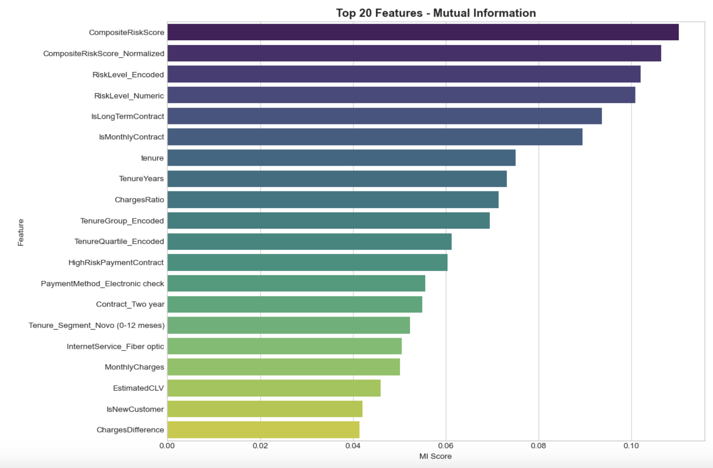

#### 📈 Output Esperado

```
  • Colunas numéricas: 64
  • Colunas binárias (não normalizar): 47
  • Colunas para normalizar: 17
	
Normalização concluída!

Scaler salvo em: ../models/scaler.pkl
```

---
## ⚖️ 10. Tratamento de Desbalanceamento

### 🎯 Problema identificado

Distribuição Original: 
* *Não Churn (0): 5,174 (73.5%)
* Churn (1): 1,869 (26.5%)

⚠️ Desbalanceamento: 
* 2.77 : 1

### 🔧 Solução: SMOTE 

**SMOTE** (Synthetic Minority Over-sampling Technique)
#### 📊 Código de implementação

```python
from imblearn.over_sampling import SMOTE

# Aplicar SMOTE
smote = SMOTE(
    random_state=42, 
    sampling_strategy=0.8  # 80% da classe majoritária
)

X_train_balanced, y_train_balanced = smote.fit_resample(
    X_train_scaled, 
    y_train
)
```
#### 📈 Output Esperado
```
✅ SMOTE aplicado!

📊 Antes: 
	• Não Churn: 4,139 (73.5%) 
	• Churn: 1,495 (26.5%) 
	• Total: 5,634

📊 Depois: 
	• Não Churn: 4,139 (55.6%) 
	• Churn: 3,311 (44.4%) 
	• Total: 7,450

📈 Aumento: +1,816 samples (+32.2%)
```
---
## 💾  11. Exportação dos Dados Preparados

### 11.1. Dados completos (todas as features)

```python
# Criar diretório se não existir
processed_dir = Path("../data/processed")
processed_dir.mkdir(parents=True, exist_ok=True)

X_train_scaled.to_csv(processed_dir / "X_train_full.csv", index=False)
X_test_scaled.to_csv(processed_dir / "X_test_full.csv", index=False)
y_train.to_csv(processed_dir / "y_train.csv", index=False, header=['Churn'])
y_test.to_csv(processed_dir / "y_test.csv", index=False, header=['Churn'])

print("Dados completos exportados:")
print(f"  • X_train_full.csv ({X_train_scaled.shape})")
print(f"  • X_test_full.csv ({X_test_scaled.shape})")
print(f"  • y_train.csv ({y_train.shape})")
print(f"  • y_test.csv ({y_test.shape})")
```

#### 📈 Output Esperado

```output
Dados completos exportados:
  • X_train_full.csv ((5634, 65))
  • X_test_full.csv ((1409, 65))
  • y_train.csv ((5634,))
  • y_test.csv ((1409,))
```

### 11.2. Dados balanceados (SMOTE)

```python
# Exportar X_train_balanced
pd.DataFrame(X_train_balanced, columns=X_train_scaled.columns).to_csv(
    processed_dir / "X_train_balanced.csv", index=False
)

# Exportar y_train_balanced
# Para garantir que y_train_balanced (que é uma Series ou array 1D) seja salvo corretamente como um DataFrame
# com uma única coluna 'Churn', usamos .to_frame(name='Churn').
y_train_balanced.to_frame(name='Churn').to_csv(
    processed_dir / "y_train_balanced.csv", index=False
)

print("\nDados balanceados exportados:")
print(f"  • X_train_balanced.csv ({X_train_balanced.shape})")
print(f"  • y_train_balanced.csv ({y_train_balanced.shape})")
```
#### 📈 Output Esperado

``` output
Dados balanceados exportados:
  • X_train_balanced.csv ((7450, 65))
  • y_train_balanced.csv ((7450,))
```

### 11.3. Dados com features selecionadas

```python
X_train_selected.to_csv(processed_dir / "X_train_selected.csv", index=False)
X_test_selected.to_csv(processed_dir / "X_test_selected.csv", index=False)

print("\nDados com features selecionadas exportados:")
print(f"  • X_train_selected.csv ({X_train_selected.shape})")
print(f"  • X_test_selected.csv ({X_test_selected.shape})")
```
#### 📈 Output Esperado

``` output
Dados com features selecionadas exportados:
  • X_train_selected.csv ((5634, 50))
  • X_test_selected.csv ((1409, 50))
```

### 11.4. Salvar lista de features selecionadas

```python
with open(processed_dir / "selected_features.txt", 'w') as f:
    f.write('\n'.join(selected_features))

print("\nLista de features selecionadas salva")
```
#### 📈 Output Esperado

``` output
Lista de features selecionadas salva
```

### 11.5. Salvar metadados

```python
metadata = {
    'total_features': X_train_scaled.shape[1],
    'selected_features': len(selected_features),
    'train_samples': X_train_scaled.shape[0],
    'test_samples': X_test_scaled.shape[0],
    'train_churn_rate': float(y_train.mean()),
    'test_churn_rate': float(y_test.mean()),
    'balanced_samples': X_train_balanced.shape[0],
    'balanced_churn_rate': float(y_train_balanced.mean())
}

import json
with open(processed_dir / "metadata.json", 'w') as f:
  json.dump(metadata, f, indent=4)


print("\nMetadados salvos")
```
#### 📈 Output Esperado

``` output
Metadados salvos
```

### 📁 Arquivos Gerados

| #   | Arquivo                | Descrição                  | Shape        |
| --- | ---------------------- | -------------------------- | ------------ |
| 1   | `X_train_full.csv`     | Features treino (completo) | (5,634 × 65) |
| 2   | `X_test_full.csv`      | Features teste (completo)  | (1,409 × 65) |
| 3   | `y_train.csv`          | Target treino              | (5,634 × 1)  |
| 4   | `y_test.csv`           | Target teste               | (1,409 × 1)  |
| 5   | `X_train_balanced.csv` | Features treino (SMOTE)    | (7,450 × 65) |
| 6   | `y_train_balanced.csv` | Target treino (SMOTE)      | (7,450 × 1)  |
| 7   | `X_train_selected.csv` | Features treino (top 50)   | (5,634 × 50) |
| 8   | `X_test_selected.csv`  | Features teste (top 50)    | (1,409 × 50) |

### 📊 Arquivos Auxiliares

| Arquivo                 | Descrição                         |
| ----------------------- | --------------------------------- |
| `scaler.pkl`            | StandardScaler treinado           |
| `selected_features.txt` | Lista de 50 features selecionadas |
| `metadata.json`         | Metadados do processamento        |

---

## 📊 12. Resumo Final

**ESTATÍSTICAS FINAIS:**


1. **FEATURES CRIADAS:**
* Total de novas features: 29
* Features após encoding: 65
* Features selecionadas: 50

2. **DATASETS PREPARADOS:**
* Treino (completo): (5634, 65)
* Teste (completo): (1409, 65)
* Treino (balanceado): (7450, 65)
* Treino (selecionado): (5634, 50)

3. **DISTRIBUIÇÃO DO TARGET:**
* Treino original: 26.5% churn
* Teste: 26.5% churn
* Treino balanceado: 44.4% churn

4. **TRANSFORMAÇÕES APLICADAS:**
* Criação de 29 novas features
* Label Encoding (3 variáveis ordinais)
* One-Hot Encoding (variáveis nominais)
* Normalização (StandardScaler)
* Balanceamento (SMOTE)
* Feature Selection (Mutual Information)

5. **ARQUIVOS EXPORTADOS:**
* X_train_full.csv
*  X_test_full.csv
* X_train_balanced.csv
* X_train_selected.csv
* y_train.csv / y_test.csv / y_train_balanced.csv
* scaler.pkl
* selected_features.txt
* metadata.json

---

**PRÓXIMOS PASSOS:**

```
   → Notebook 04: Modelagem Preditiva
   → Treinar múltiplos algoritmos
   → Avaliar performance
   → Selecionar melhor modelo
   → Interpretar resultados
```


##  👀 13. Visualização Final - Feature Importance

**Features criadas no Top 20: 10 (50%)**:

  ```
  • CompositeRiskScore
  • CompositeRiskScore_Normalized
  • IsLongTermContract
  • IsMonthlyContract
  • TenureYears
  • ChargesRatio
  • HighRiskPaymentContract
  • EstimatedCLV
  • IsNewCustomer
  • ChargesDifference
  ```

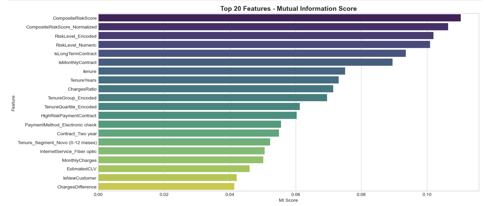
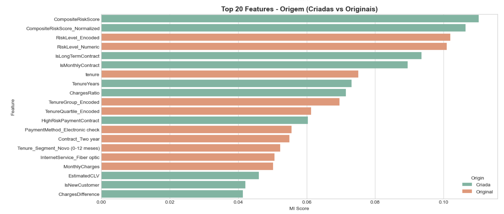


## 💡 Conclusão

O que foi realizado:

##### 1. **Criação de 29 novas features** baseadas em:
- Conhecimento de negócio
- Insights do EDA
- Combinações de variáveis existentes

##### 2. **Transformações aplicadas:**
- Encoding de categóricas (Label + One-Hot)
- Normalização de numéricas
- Balanceamento de classes (SMOTE)
- Seleção de features (Mutual Information)

##### 3. **Datasets preparados:**
- Completo (todas as features)
- Balanceado (SMOTE)
- Selecionado (top features)


## 🚀 Como Executar

### 1️⃣ Pré-requisitos

```bash
pip install pandas numpy matplotlib seaborn scikit-learn imbalanced-learn
```

### 2️⃣ Executar Notebook

```bash
cd notebooks
jupyter notebook 03_engenharia_feature.ipynb
```
### 3️⃣ Executar Todas as Células

```Kernel → Restart & Run All```

---
## ➡️ Próximos Passos

**Notebook 04 - Modelagem Preditiva:**

- ✅ Treinar múltiplos algoritmos (RF, XGBoost, LightGBM)
- ✅ Avaliar performance (AUC-ROC, Precision, Recall)
- ✅ Tuning de hiperparâmetros
- ✅ Seleção do melhor modelo
- ✅ Análise de feature importance
- ✅ Curvas de aprendizado

---

## 🔄 Notas de Versão

| Versão | Data       | Descrição                                                           |
| ------ | ---------- | ------------------------------------------------------------------- |
| 1.0    | 09/02/2026 | Engeharia das features completa implementada                        |
| 1.1    | 11/02/2026 | Documentação Exportação                                             |
| 1.2    | 12/02/2026 | Atualização no trecho do código em:11.2. Dados balanceados (SMOTE)  |
| 2.0    | 25/02/2026 | Atualização e revisão final do conteúdo                             |


## 👤 **Autor**
**Nome:** Ivan Ajala  
**Função:** Data Scientist  
**Projeto:** Telco Customer Churn Prediction


**⭐ Se este projeto foi útil, considere dar uma estrela no GitHub!**

  [](https://github.com/IvanAjala/ivan-ajala-ds-portfolio/stargazers)
  [](https://github.com/IvanAjala/ivan-ajala-ds-portfolio/network/members)
  [](https://github.com/IvanAjala/ivan-ajala-ds-portfolio/blob/main/projects/01-telco-customer-churn-prediction/LICENSE)
  [](https://www.python.org/)
  [](https://streamlit.io/)

### 🔗 Navegação Rápida

**⬅️ [Anterior](./README_02_analise_exploratoria.md)** | **[🔝 Voltar ao topo](#-visão-geral)** | **➡️ [Próximo](./README_04_modelagem_preditiva.md)**

---
