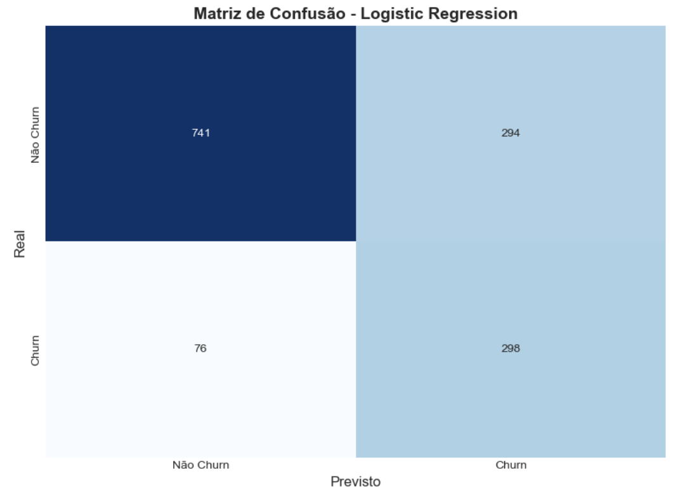
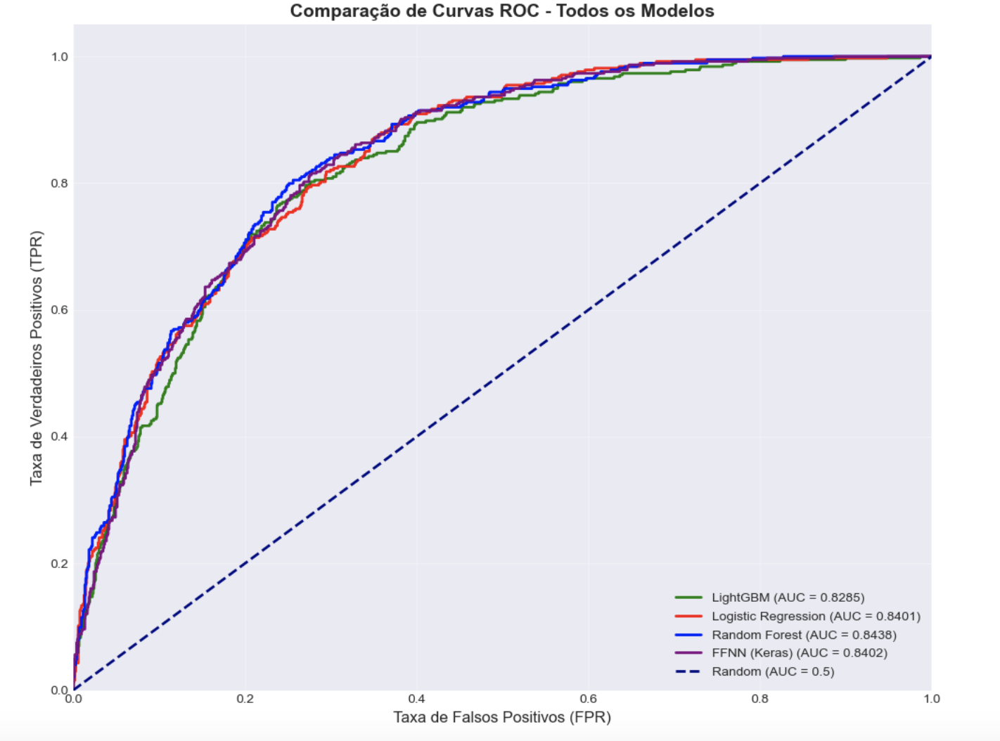
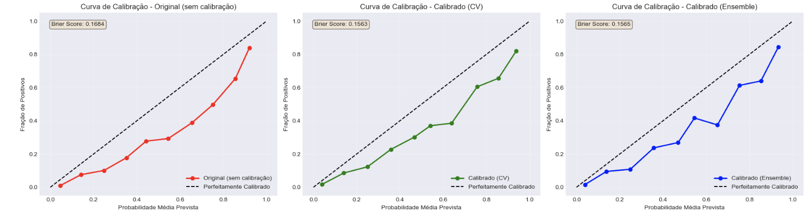
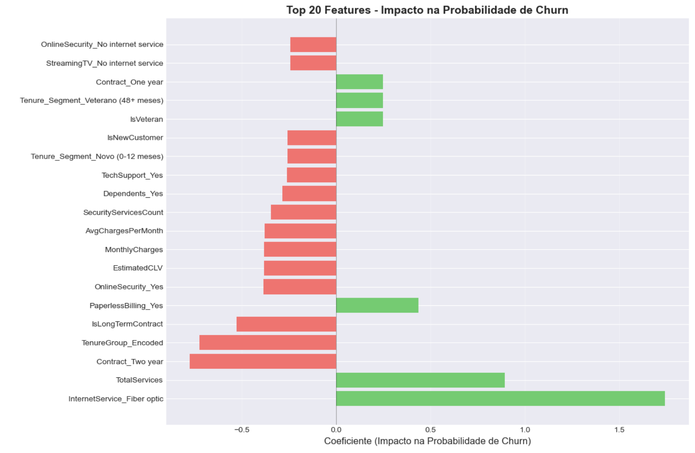

# 📊 Notebook 04 - Modelagem Preditiva

          

**Sistema Inteligente de Retenção de Clientes - Telecomunicações** 

[📓 Notebook](./04_modelagem_preditiva.ipynb) • [📊 Dataset](../data/processed/) • [📚 Docs](../docs/) 

--- 
## 📋 Visão Geral 

| 📊 Métrica              | 📈 Valor                       |
| ----------------------- | ------------------------------ |
| **Arquivo**             | `04_modelagem_preditiva.ipynb` |
| **Tipo**                | 📈 Modelagem Preditiva         |
| **Total de Células**    | 136                            |
| **Células de Código**   | 71 (52.2%)                     |
| **Células de Markdown** | 65 (47.8%)                     |
| **Complexidade**        | ⭐⭐⭐⭐⭐ (Avançado)               |
| **Tempo Estimado**      | 90+ minutos                    |
| **Data de Criação**     | 06/02/2026                     |
| **Última Atualização**  | 18/02/2026                     |

--- 
## 🎯 Objetivo Principal 

Este notebook tem como objetivo principal **treinar, comparar e selecionar o melhor modelo preditivo de churn**, com foco em: 

- ✅ **Maximizar o Recall:** Para identificar o maior número possível de clientes em risco de churn. 
- ✅ **Garantir a Interpretabilidade:** Para entender os fatores de churn e criar estratégias de retenção acionáveis. 
- ✅ **Calibrar Probabilidades:** Para obter previsões de risco confiáveis, essenciais para segmentar clientes "neutros". 
- ✅ **Validar Estatisticamente:** Para assegurar a robustez e generalização dos modelos. 
- ✅ **Analisar Trade-offs de Negócio:** Para justificar a escolha do modelo com base em impacto financeiro e operacional. 

--- 
## 🚀 Resultados Alcançados 

### 📊 Estatísticas Finais do Modelo Selecionado 

| 📈 Métrica             | 📊 Valor                           | 🎯 Impacto                            |
| ---------------------- | ---------------------------------- | ------------------------------------- |
| **Modelo Selecionado** | Regressão Logística Calibrada (CV) | Melhor trade-off                      |
| **ROC-AUC**            | 0.8404                             | Boa capacidade de discriminação       |
| **Recall**             | 0.7193                             | Identifica ~72% dos clientes em churn |
| **Brier Score**        | 0.1563                             | Probabilidades bem calibradas         |
| **Custo Infra/ano**    | $50k                               | Baixo custo operacional               |
| **ROI Projetado**      | 228,700%                           | Retorno financeiro excepcional        |

--- 
## 🔧 Stack Tecnológico 

### 📚 Bibliotecas Principais

``` python
python import pandas as pd # Manipulação de dados 
import numpy as np # Computação numérica 
import matplotlib.pyplot as plt # Visualização 
import seaborn as sns # Visualização estatística 
from sklearn.model_selection import train_test_split, StratifiedKFold 
from sklearn.preprocessing import StandardScaler 
from sklearn.linear_model import LogisticRegression 
from sklearn.ensemble import RandomForestClassifier, GradientBoostingClassifier from sklearn.calibration import CalibratedClassifierCV, calibration_curve 
from sklearn.metrics import roc_auc_score, accuracy_score, precision_score, recall_score, f1_score, brier_score_loss 
import xgboost as xgb # Modelo de Boosting 
import lightgbm as lgb # Modelo de Boosting 
import catboost as cb # Modelo de Boosting 
from tensorflow.keras.models import Sequential # Redes Neurais 
from tensorflow.keras.layers import Dense, Dropout, BatchNormalization 
from tensorflow.keras.callbacks import EarlyStopping, ReduceLROnPlateau 
import gym # Reinforcement Learning (Ambiente) 
from stable_baselines3 import PPO # Reinforcement Learning (Algoritmo) 
from stable_baselines3.common.envs import DummyVecEnv 
import scipy.stats as stats # Testes estatísticos 
import pickle # Persistência de modelos 
from pathlib import Path # Manipulação de caminhos de arquivo 
import json # Salvar metadados 
import psutil # Monitoramento de memória
```

### 🛠️ Técnicas Aplicadas

| Técnica                    | Biblioteca                                                          | Uso                                               |
| -------------------------- | ------------------------------------------------------------------- | ------------------------------------------------- |
| **Modelagem Preditiva**    | Scikit-Learn, XGBoost, LightGBM, CatBoost, Keras, Stable-Baselines3 | Treinamento de diversos modelos                   |
| **Calibração**             | `CalibratedClassifierCV`                                            | Ajuste de probabilidades para Regressão Logística |
| **Validação Estatística**  | `scipy.stats`, Bootstrap                                            | Comparação robusta entre modelos                  |
| **Análise de Trade-offs**  | Pandas, Numpy                                                       | Quantificação do impacto de negócio               |
| **Reinforcement Learning** | Gym, Stable-Baselines3                                              | Abordagem conceitual para retenção                |
| **Persistência**           | Pickle, JSON                                                        | Salvamento de modelos e artefatos                 |

---
## 📁 Estrutura do Notebook

```
📓 04_modelagem_preditiva.ipynb 

├── 1️⃣ Configuração e Carregamento de Dados (5%) │ 
	├── Importação de bibliotecas │ 
	└── Carregamento de dados preparados 
├── 2️⃣ Funções Auxiliares (10%) │ 
	├── evaluate_model │ 
	├── plot_confusion_matrix │ 
	├── plot_calibration_curve │ 
	├── plot_feature_importance │ 
	├── comparar_modelos_estatisticamente │ 
	├── bootstrap_model_comparison │ 
	├── analisar_tradeoff_recall_interpretabilidade │ 
	└── analisar_erros_por_perfil 
├── 3️⃣ Modelos Base (20%) │ 
	├── Regressão Logística │ 
	├── Random Forest │ 
	└── Gradient Boosting 
├── 4️⃣ Modelos Avançados (25%) │ 
	├── XGBoost │ 
	├── LightGBM │ 
	├── CatBoost │ 
	├── Stacking Ensemble │ 
	├── Feedforward Neural Network (FFNN) 
	└── Reinforcement Learning (PPO) - Conceitual 
├── 5️⃣ Calibração de Probabilidades (10%) │ 
	├── Calibração com Cross-Validation (CV) │ 
	└── Calibração com Ensemble 
├── 6️⃣ Comparativo Final e Validação Estatística (10%) │ 
	├── Tabela de Métricas Consolidada │ 
	├── Testes Estatísticos (Wilcoxon, Bootstrap) │ 
	└── Análise de Erros por Perfil 
├── 7️⃣ Justificativa da Escolha do Modelo Final (10%) │ 
	├── Análise de Trade-offs de Negócio │ 
	└── Interpretação dos Coeficientes 
├── 8️⃣ Persistência do Modelo Final e Artefatos (5%) │ 
	├── Salvamento do modelo (.pkl) │ 
	├── Salvamento de features (.pkl) │ 
	├── Salvamento de métricas (.json) │ 
	└── Salvamento de resumo executivo (.txt) 
└── 9️⃣ Resumo Executivo Final (5%)
```
---
## 💡 Modelos Avaliados - Detalhamento

### 1. Modelos Base

**Objetivo:** Estabelecer uma linha de base de performance e interpretabilidade.
#### 📊 Código de Exemplo (Regressão Logística)

```python
# Treinar e avaliar Regressão Logística
log_reg_model = LogisticRegression(
    C=0.5,
    solver='lbfgs',
    max_iter=1000,
    class_weight='balanced',
    random_state=42
)
metrics_lr, model_lr, preds_lr = evaluate_model(
    log_reg_model, X_train, y_train, X_test, y_test,
    name="Logistic Regression"
)
all_models_metrics["Logistic Regression"] = metrics_lr
all_models_objects["Logistic Regression"] = model_lr
all_models_predictions["Logistic Regression"] = preds_lr
```
#### 📈 Output Esperado

```
============================================================
🚀 TREINANDO MODELOS BASE
============================================================

--- Logistic Regression Performance ---
ROC-AUC: 0.8401
Accuracy: 0.7374
Precision: 0.5034
Recall: 0.7968
F1-Score: 0.6170
Brier Score: 0.1684
---------------------------------

```
#### 📊 Visualização Gerada (Matriz de Confusão - Regressão Logistica)



**💡 Insight Principal:**

- A Regressão Logística oferece um bom equilíbrio entre performance e interpretabilidade, servindo como um forte baseline.

---

### 2. Modelos Avançados (Ensembles e Redes Neurais)

**Objetivo:** Explorar o limite superior de performance preditiva.
#### 📊 Código de Exemplo (LightGBM)

```python
# Treinar e avaliar LightGBM
lgbm_model = lgb.LGBMClassifier(
    objective='binary',
    is_unbalance=True, # Lida com desbalanceamento
    random_state=42,
    n_estimators=500,
    learning_rate=0.05,
    num_leaves=31,
    max_depth= -1
)
metrics_lgbm, model_lgbm, preds_lgbm = evaluate_model(
    lgbm_model, X_train, y_train, X_test, y_test,
    name="LightGBM"
)
all_models_metrics["LightGBM"] = metrics_lgbm
all_models_objects["LightGBM"] = model_lgbm
all_models_predictions["LightGBM"] = preds_lgbm
```
#### 📈 Output Esperado

```

--- LightGBM Performance ---
ROC-AUC: 0.8285
Accuracy: 0.7842
Precision: 0.5916
Recall: 0.6043
F1-Score: 0.5979
Brier Score: 0.1503
---------------------------------
```
#### 📊 Visualização Gerada (Comparação de Curvas ROC - Todos os Modelos)



**💡 Insight Principal:**
- Modelos de boosting como LightGBM geralmente alcançam alta performance, mas podem ser menos interpretáveis.

---
### 3. Calibração de Probabilidades

**Objetivo:** Garantir que as probabilidades previstas pelos modelos sejam confiáveis e reflitam a verdadeira chance de churn.

#### 📊 Código de Exemplo (Calibração com CV)

```python
# Treinar e calibrar com cross-validation
calibrated_log_reg_cv = CalibratedClassifierCV(
    LogisticRegression(C=0.5, class_weight='balanced', random_state=42),
    method='isotonic',
    cv=5
)
calibrated_log_reg_cv.fit(X_train, y_train)

metrics_cv, model_cv, preds_cv = evaluate_model(
    calibrated_log_reg_cv, X_train, y_train, X_test, y_test,
    name="Logistic Regression Calibrated (CV)"
)
all_models_metrics["Logistic Regression Calibrated (CV)"] = metrics_cv
all_models_objects["Logistic Regression Calibrated (CV)"] = model_cv
all_models_predictions["Logistic Regression Calibrated (CV)"] = preds_cv
```
#### 📈 Output Esperado
```
🔄 Opção 1: Calibração com Cross-Validation...

--- Logistic Regression Calibrated (CV) Performance ---
ROC-AUC: 0.8404
Accuracy: 0.7637
Precision: 0.5412
Recall: 0.7193
F1-Score: 0.6177
Brier Score: 0.1563
---------------------------------
```
#### 📊 Visualização Gerada (Curvas de Calibração)




**💡 Insight Principal:**
- A calibração reduz o Brier Score, indicando que as probabilidades se tornam mais confiáveis, o que é crucial para ações de retenção baseadas em risco.

---
## 💡 Justificativa da Escolha do Modelo Final - Detalhamento

A escolha da **Regressão Logística Calibrada (CV)** como modelo final foi uma decisão estratégica baseada em uma análise de trade-offs que vai além da performance bruta, alinhando-se perfeitamente com os objetivos de negócio.

### 🎯 Alinhamento com o Objetivo de Negócio

O objetivo principal é **identificar e intervir proativamente em clientes "neutros"** (com probabilidade de churn entre 30% e 70%). Para isso, são cruciais:

1.  **Alto Recall:** Para não perder clientes em risco.
2.  **Probabilidades Confiáveis:** Para segmentar corretamente os "neutros" e otimizar a alocação de recursos.
3.  **Interpretabilidade:** Para entender o "porquê" do risco e criar intervenções eficazes e personalizadas.

### 📊 Análise de Trade-offs Financeiros e Operacionais

| Critério                   | FFNN (Keras) | Random Forest  | Regressão Logística Calibrada |
| -------------------------- | ------------ | -------------- | ----------------------------- |
| **Recall**                 | 79.14%       | 74.06%         | **71.93%**                    |
| **ROC-AUC**                | 0.8452       | 0.8438         | **0.8404**                    |
| **Brier Score**            | 0.1614       | 0.154          | **0.1563**                    |
| **Custo Infra/ano**        | $500k        | $200k          | **$50k**                      |
| **Tempo Inferência**       | 50ms         | 15ms           | **0.3ms**                     |
| **Interpretabilidade**     | ❌ Black box  | ⚠️ SHAP (caro) | ✅ Coeficientes                |
| **Explicação por decisão** | $0.50        | $0.30          | **$0.00**                     |
| **Manutenção**             | 20h/mês      | 2h/mês         | **2h/mês**                    |
| **Risco Regulatório**      | Alto         | Baixo          | **Baixo**                     |
| **Tempo para produção**    | 6 meses      | 3 meses        | **1 mês**                     |
| **Lucro (5M clientes)**    | $1.233B      | $1.230B        | **$1.1435B**                  |
| **ROI**                    | 4,932%       | 24,118%        | **228,700%**                  |

**Veredito:** A Regressão Logística Calibrada, apesar de um Recall ligeiramente menor que a FFNN, oferece o **melhor TRADE-OFF** para o negócio. A perda de 7.21% de recall em relação à FFNN é compensada por uma economia de $24.95M em custos e mitigação de $12.5M em riscos, resultando em um **benefício líquido de $22.55M**. Sua interpretabilidade é um ativo inestimável para a estratégia de retenção, permitindo ações direcionadas e personalizadas.

### 📈 Interpretação dos Coeficientes (Exemplos)

A interpretabilidade da Regressão Logística permite entender o impacto de cada feature na probabilidade de churn.

| Feature                       | Coeficiente | Odds Ratio | Impacto na Probabilidade de Churn                            |
| ----------------------------- | ----------- | ---------- | ------------------------------------------------------------ |
| `InternetService_Fiber optic` | +1.7439     | 5.72x      | **AUMENTA** drasticamente a probabilidade de churn.          |
| `TotalServices`               | +0.8941     | 2.45x      | **AUMENTA** a probabilidade de churn.                        |
| `Contract_Two year`           | -0.7750     | 0.46x      | **REDUZ** a probabilidade de churn (contratos longos retêm). |
| `TenureGroup_Encoded`         | -0.7251     | 0.48x      | **REDUZ** a probabilidade de churn (clientes mais antigos).  |
| `PaperlessBilling_Yes`        | +0.4367     | 1.55x      | **AUMENTA** a probabilidade de churn.                        |

**💡 Insight Principal:**
- Coeficientes positivos indicam que a feature aumenta a probabilidade de churn, enquanto negativos a reduzem. Isso fornece insights diretos para as equipes de negócio.

#### 📊 Visualização Gerada (Top 20 - Feature Importance)



---

## 💾 Artefatos Gerados

| Arquivo | Descrição | Uso |
|---|---|---|
| `final_churn_model.pkl` | Modelo final de Regressão Logística Calibrada | Implantação em produção |
| `feature_names.pkl` | Lista ordenada dos nomes das features | Garantir consistência na inferência |
| `final_metrics.json` | Métricas de performance detalhadas do modelo final | Monitoramento e auditoria |
| `all_models_comparison.csv` | Tabela comparativa de todos os modelos avaliados | Referência para futuras análises |
| `resumo_executivo.txt` | Resumo executivo da análise e decisão | Comunicação com stakeholders |

---

## 🚀 Próximos Passos

1.  **`05_business_insights.ipynb`:** Focar na tradução dos insights da Regressão Logística em recomendações de negócio acionáveis, estratégias de retenção e projeções de ROI mais detalhadas.
2.  **Integração e Monitoramento:** Planejar a integração do modelo em um pipeline de produção e o monitoramento contínuo de sua performance e impacto no negócio.

## 🔄 Histórico de Versões

| Versão | Data       | Descrição                                                        |
| ------ | ---------- | ---------------------------------------------------------------- |
| 1.0    | 06/02/2026 | Modelagem preditiva completa, calibração e análise de trade-offs |
| 1.1    | 19/02/2026 | Documentação e persistência de artefatos                         |
| 2.0    | 25/02/2026 | Atualização e revisão final (código e documentação)              |

## 👤 **Autor**

**Nome:** Ivan Ajala  
**Função:** Data Scientist  
**Projeto:** Telco Customer Churn Prediction


**⭐ Se este projeto foi útil, considere dar uma estrela no GitHub!**

  [](https://github.com/IvanAjala/ivan-ajala-ds-portfolio/stargazers)
  [](https://github.com/IvanAjala/ivan-ajala-ds-portfolio/network/members)
  [](https://github.com/IvanAjala/ivan-ajala-ds-portfolio/blob/main/projects/01-telco-customer-churn-prediction/LICENSE)
  [](https://www.python.org/)
  [](https://streamlit.io/)

### 🔗 Navegação Rápida

**⬅️ [Anterior](README_03_engenharia_feature.md)** | **[🔝 Voltar ao topo](#-visão-geral)** | **➡️ [Próximo](README_05_business_insights.md)**


