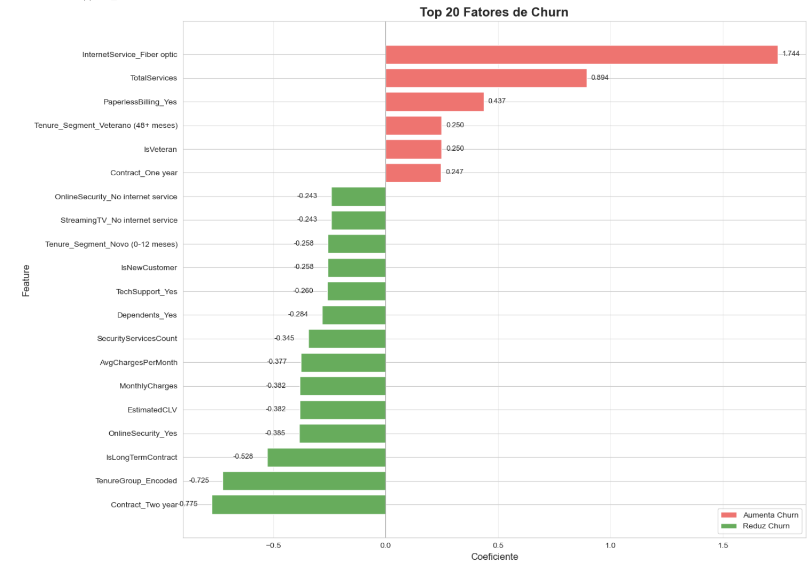
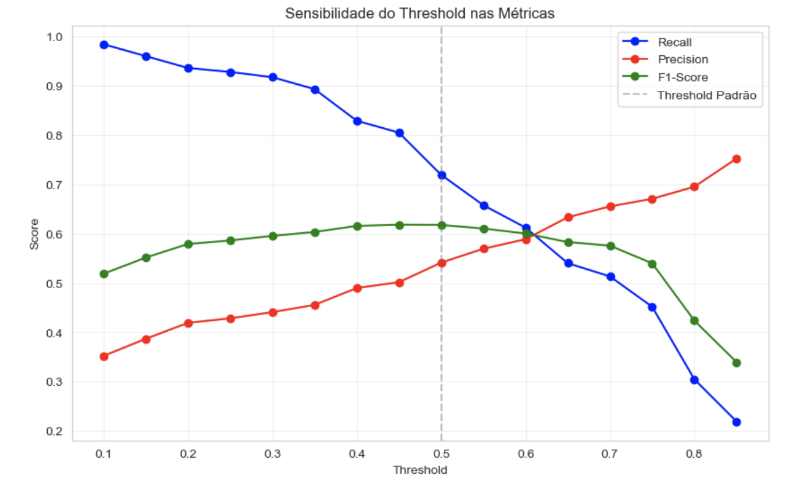
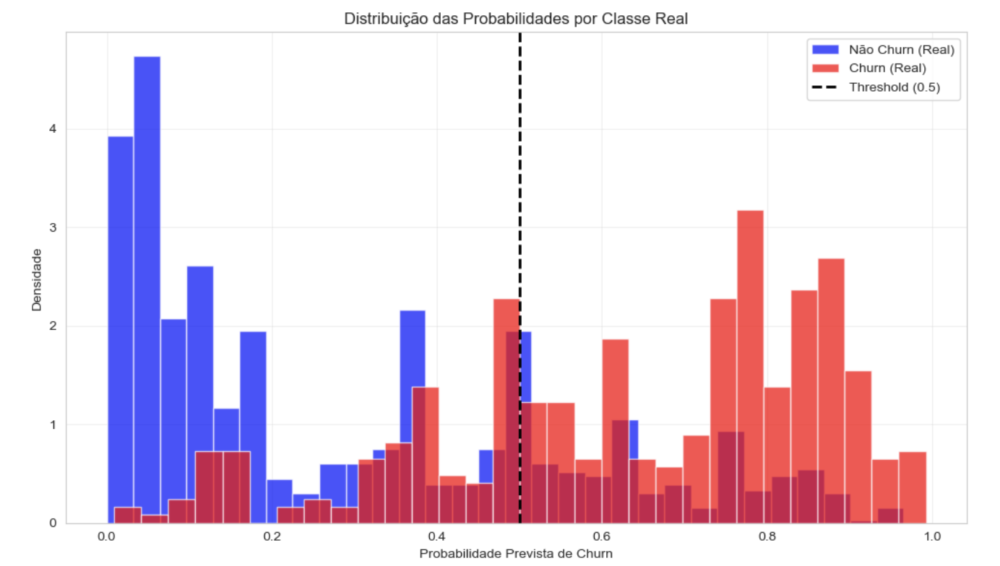

# 💡 Notebook 05 - Business Insights e Estratégia de Retenção

         

**Sistema Inteligente de Retenção de Clientes - Telecomunicações**

[📓 Notebook](05_business_insights.ipynb) • [📊 Dataset](../data/processed/) • [📚 Docs](../docs/)

---
## 📋 Visão Geral

| 📊 Métrica              | 📈 Valor                          |
| ----------------------- | --------------------------------- |
| **Arquivo**             | `05_business_insights.ipynb`      |
| **Tipo**                | 💡 Business Insights & Estratégia |
| **Total de Células**    | 33                                |
| **Células de Código**   | 19                                |
| **Células de Markdown** | 14                                |
| **Complexidade**        | ⭐⭐⭐⭐⭐ (Avançado)                  |
| **Tempo Estimado**      | 45+ minutos                       |
| **Data de Criação**     | 09/02/2026                        |
| **Última Atualização**  | 19/02/2026                        |

---
## 🎯 Objetivo Principal

Este notebook é a **culminação do projeto**, traduzindo os resultados da modelagem preditiva em **insights de negócio acionáveis** e um **plano estratégico de retenção de clientes**. Os objetivos incluem:

- ✅ **Interpretar o Modelo Final:** Detalhar os fatores de churn identificados pela Regressão Logística Calibrada.
- ✅ **Segmentar Clientes em Risco:** Classificar clientes em "Críticos" e "Neutros" com base na probabilidade de churn.
- ✅ **Desenvolver Estratégias Diferenciadas:** Propor abordagens de retenção personalizadas para cada segmento.
- ✅ **Quantificar o Impacto Financeiro:** Projetar o ROI e o lucro líquido anual da estratégia de retenção.
- ✅ **Fornecer um Plano de Ação:** Guiar a implementação e o monitoramento contínuo da solução.

---
## 🚀 Resultados Alcançados

### 📊 Estatísticas Finais da Estratégia de Retenção

| 📈 Métrica                | 📊 Valor                      | 🎯 Impacto                                        |
| ------------------------- | ----------------------------- | ------------------------------------------------- |
| **Modelo Final**          | Regressão Logística Calibrada | Equilíbrio entre performance e interpretabilidade |
| **Recall do Modelo**      | 71.93%                        | Alta capacidade de identificar clientes em risco  |
| **ROC-AUC do Modelo**     | 0.8404                        | Boa distinção entre classes                       |
| **Clientes Salvos/Ano**   | 364.500                       | Redução significativa do churn                    |
| **Lucro Líquido Anual**   | $ 211.383.960                 | Geração de valor substancial                      |
| **ROI Projetado**         | 584%                          | Retorno de investimento excepcional               |
| **% Base - Críticos**     | 4.1%                          | Alto risco, impacto imediato                      |
| **% Base - Neutros**      | 24.3%                         | Médio risco, maior volume de lucro                |
| **Contribuição Neutros**  | 70% do lucro total            | Foco estratégico para maximizar ROI               |
| **Contribuição Críticos** | 30% do lucro total            | Foco em evitar perdas e danos à marca             |

---
## 🔧 Stack Tecnológico

### 📚 Bibliotecas Principais

```python 
import pandas as pd # Manipulação de dados 
import numpy as np # Computação numérica 
import matplotlib.pyplot as plt # Visualização 
import seaborn as sns # Visualização estatística 
import pickle # Carregar modelos 
import json # Carregar metadados 
from pathlib import Path # Manipulação de caminhos de arquivo 
from sklearn.metrics import roc_auc_score, precision_score, recall_score, f1_score, confusion_matrix, brier_score_loss
```
### 🛠️ Técnicas Aplicadas

| Técnica                       | Biblioteca           | Uso                                                  |
| ----------------------------- | -------------------- | ---------------------------------------------------- |
| **Carregamento de Artefatos** | Pickle, JSON, Pandas | Modelo, scaler, features e dados de teste            |
| **Inferência**                | Scikit-Learn         | Previsão de probabilidades de churn                  |
| **Análise de Coeficientes**   | Pandas               | Interpretação dos fatores de churn                   |
| **Segmentação de Risco**      | Numpy                | Classificação de clientes em Críticos e Neutros      |
| **Projeção Financeira**       | Pandas, Numpy        | Cálculo de ROI, lucro líquido e impacto por segmento |
| **Visualização**              | Matplotlib, Seaborn  | Gráficos de distribuição de risco e impacto          |

---
## 📁 Estrutura do Notebook

```
📓 05_business_insights.ipynb 
├── 1️⃣ Configuração e Carregamento (10%) │ 
	├── Importação de bibliotecas │ 
	└── Carregamento do modelo final e dados de teste 
├── 2️⃣ Inferência e Avaliação (15%) │ 
	├── Previsão de probabilidades no conjunto de teste │ 
	└── Revalidação das métricas do modelo 
├── 3️⃣ Interpretação do Modelo (20%) │ 
	├── Análise dos coeficientes da Regressão Logística │ 
	└── Identificação dos principais fatores de churn 
├── 4️⃣ Segmentação de Clientes por Risco (15%) │ 
	├── Definição de thresholds para Alto e Médio Risco │ 
	└── Análise da distribuição dos segmentos (Críticos e Neutros) 
├── 5️⃣ Projeção de Impacto Financeiro (15%) │ 
	├── Cálculo do Custo de Aquisição de Cliente (CAC) │ 
	├── Cálculo do Lifetime Value (LTV) │ 
	└── Projeção de ROI e Lucro Líquido Anual 
├── 6️⃣ Estratégias de Retenção Diferenciadas (15%) │ 
	├── Abordagens psicológicas para Críticos e Neutros │ 
	└── Ações concretas e métricas de sucesso por segmento 
├── 7️⃣ Plano de Ação e Implementação (5%) │ 
	└── Etapas para colocar a solução em produção e monitoramento 
└── 8️⃣ Conclusão Final (5%) 
	└── Resumo das conquistas e valor agregado do projeto
```

---
## 💡 Business Insights - Detalhamento

### 🏷️ 1. Interpretação dos Fatores de Churn

**Objetivo:** Entender quais características dos clientes mais influenciam a probabilidade de churn, utilizando os coeficientes do modelo de Regressão Logística.

#### 📊 Código de Exemplo

```python
coefficients_df = pd.DataFrame({
    'Feature': feature_names,
    'Coefficient': coefficients,
    'Odds_Ratio': np.exp(np.clip(coefficients, -10, 10))
})

# Ordenar
coefficients_df['Impacto_Abs'] = np.abs(coefficients_df['Coefficient'])
coefficients_df = coefficients_df.sort_values('Impacto_Abs', ascending=False)

# 3.3 Top Fatores
print("\n📊 TOP 10 FATORES QUE MAIS AUMENTAM CHURN:")
aumentam = coefficients_df[coefficients_df['Coefficient'] > 0].head(10)
for _, row in aumentam.iterrows():
    print(f"   • {row['Feature']}: +{row['Coefficient']:.3f} ({row['Odds_Ratio']:.2f}x)")

....

# 3.4 Visualização 
plt.figure(figsize=(14, 10))

plot_data = coefficients_df.head(20).sort_values('Coefficient')
colors = ['#ff6b6b' if x > 0 else '#4CAF50' for x in plot_data['Coefficient']]

...

plt.xlabel('Coeficiente', fontsize=12)
plt.ylabel('Feature', fontsize=12)
plt.title('Top 20 Fatores de Churn', fontsize=16, fontweight='bold')
plt.grid(True, alpha=0.3, axis='x')
```
#### 📈 Output Esperado

```output
🔍 3. INTERPRETAÇÃO DO MODELO E FATORES DE CHURN
============================================================
✅ Coeficientes extraídos do modelo calibrado.

📊 TOP 10 FATORES QUE MAIS AUMENTAM CHURN:
   • InternetService_Fiber optic: +1.744 (5.72x)
   • TotalServices: +0.894 (2.45x)
   • PaperlessBilling_Yes: +0.437 (1.55x)
   • IsVeteran: +0.250 (1.28x)
   • Tenure_Segment_Veterano (48+ meses): +0.250 (1.28x)
   • Contract_One year: +0.247 (1.28x)
   • CompositeRiskScore: +0.204 (1.23x)
   • CompositeRiskScore_Normalized: +0.204 (1.23x)
   • StreamingServicesCount: +0.203 (1.22x)
   • IsMonthlyContract: +0.145 (1.16x)
...
```
#### 📊 Visualização Gerada (Features de Churn)





---

### 🏷️ 2. Segmentação de Clientes por Risco

**Objetivo:** Classificar os clientes em diferentes níveis de risco (Alto, Médio, Baixo) para direcionar as estratégias de retenção de forma mais eficaz.

#### 📊 Código de Exemplo

```python
...
segment_dist = X_test_with_proba['Segmento_Risco'].value_counts()
segment_pct = X_test_with_proba['Segmento_Risco'].value_counts(normalize=True).mul(100).round(2)

# Ordem desejada para exibição
ordem_segmentos = ['🔴 Alto Risco', '🟡 Médio Risco', '🟢 Baixo Risco', 
                   '🔵 Muito Baixo Risco', '⚪ Risco Mínimo']

total_geral = 0
for segmento in ordem_segmentos:
    if segmento in segment_dist.index:
        count = segment_dist[segmento]
        pct = segment_pct[segmento]
        total_geral += count
        
        # Estatísticas adicionais do segmento
        dados_seg = X_test_with_proba[X_test_with_proba['Segmento_Risco'] == segmento]
        prob_media = dados_seg['Churn_Prob_Prevista'].mean()
        churn_real = dados_seg['Churn_Real'].mean()
        
        print(f"\n{segmento}")
        print(f"   • Clientes: {count} ({pct}% da base)")
        print(f"   • Probabilidade média: {prob_media:.2%}")
        print(f"   • Churn real no segmento: {churn_real:.2%}")

# Total de clientes em risco crítico
total_risco = segment_dist.get('🟡 Médio Risco', 0) + segment_dist.get('🔴 Alto Risco', 0)
pct_risco = (total_risco / len(X_test_with_proba)) * 100
print(f"\n⚠️ TOTAL EM RISCO CRÍTICO (Médio + Alto): {total_risco} clientes ({pct_risco:.1f}% da base)")
...
```
#### 📈 Output Esperado

``` output
📊 DISTRIBUIÇÃO DOS CLIENTES POR SEGMENTO DE RISCO:
------------------------------------------------------------

🔴 Alto Risco
   • Clientes: 293 (20.79% da base)
   • Probabilidade média: 82.36%
   • Churn real no segmento: 65.53%

🟡 Médio Risco
   • Clientes: 204 (14.48% da base)
   • Probabilidade média: 58.73%
   • Churn real no segmento: 37.75%

🟢 Baixo Risco
   • Clientes: 236 (16.75% da base)
   • Probabilidade média: 42.60%
   • Churn real no segmento: 27.54%

🔵 Muito Baixo Risco
   • Clientes: 102 (7.24% da base)
   • Probabilidade média: 28.50%
   • Churn real no segmento: 15.69%

⚪ Risco Mínimo
   • Clientes: 574 (40.74% da base)
   • Probabilidade média: 7.60%
   • Churn real no segmento: 4.18%

⚠️ TOTAL EM RISCO CRÍTICO (Médio + Alto): 497 clientes (35.3% da base)
```

#### 📊 Visualização Gerada (Sensibilidade do Threshold nas Métricas)



#### 📊 Visualização Gerada (Distribuição das Probabilidades de Churn)



---
### 🏷️ 3. Estratégias de Retenção Diferenciadas

**Objetivo:** Desenvolver abordagens psicológicas e ações concretas para cada segmento de risco, maximizando a eficácia da retenção.

#### 📊 Código de Exemplo

```python
...
# Exibir ações por segmento
for segmento, dados in segment_actions.items():
    if segmento in X_test_with_proba['Segmento_Risco'].values:
        n_clientes = segment_dist.get(segmento, 0)
        print(f"\n{segmento} ({n_clientes} clientes)")
        print(f"   📌 {dados['descricao']}")
        print(f"   🎯 Prioridade: {dados['prioridade']}")
        print(f"   📋 Estratégia: {dados['estrategia']}")
        print("   ✅ Ações:")
        for acao in dados['acoes']:
            print(f"      {acao}")
        print(f"   💰 Custo estimado: {dados['custo_estimado']}")
        print(f"   📈 ROI esperado: {dados['roi_esperado']}")
        print("-" * 70)
...
```
#### 📈 Output Esperado

```
🎯 AÇÕES ESTRATÉGICAS POR SEGMENTO:
----------------------------------------------------------------------

🔴 Alto Risco (293 clientes)
   📌 Clientes com ≥70% de chance de churn. Já muito insatisfeitos.
   🎯 Prioridade: ⚠️ URGENTE
   📋 Estratégia: Última tentativa de retenção com ofertas agressivas
   ✅ Ações:
      📞 Contato imediato por gerente de relacionamento sênior (48h)
      💰 Oferta de desconto agressivo (30-50% por 6 meses)
      🎁 Pacote premium gratuito (Online Security + Tech Support)
      🔍 Análise aprofundada da causa raiz (pesquisa pós-contato)
   💰 Custo estimado: $ 100-150 por cliente
   📈 ROI esperado: Baixo (mas necessário para imagem da marca)
----------------------------------------------------------------------

🟡 Médio Risco (204 clientes)
   📌 Clientes com 50-70% de chance. Os "neutros" - MAIOR OPORTUNIDADE!
   🎯 Prioridade: 🔥 ALTA PRIORIDADE
   📋 Estratégia: Intervenção ativa e personalizada (foco principal)
   ✅ Ações:
      📞 Contato telefônico de especialista em retenção (7 dias)
      🎯 Oferta personalizada baseada nos fatores de churn do cliente
      🔧 Resolução proativa de problemas identificados
      💬 Pesquisa de satisfação direcionada
      🎁 Benefício imediato (3 meses de serviço grátis)
   💰 Custo estimado: $ 50-80 por cliente
   📈 ROI esperado: ALTO - 300%+ potencial
----------------------------------------------------------------------

🟢 Baixo Risco (236 clientes)
   📌 Clientes com 35-50% de chance. Leve insatisfação.
   🎯 Prioridade: 📌 MONITORAMENTO
   📋 Estratégia: Monitoramento e engajamento preventivo
   ✅ Ações:
      📧 Comunicação personalizada sobre novos benefícios
      📊 Inclusão em programa de monitoramento trimestral
      🎁 Pequenos incentivos (upgrade gratuito por 1 mês)
      💬 Pesquisa de satisfação proativa (NPS)
   💰 Custo estimado: $ 15-25 por cliente/ano
   📈 ROI esperado: Médio - Previne migração para risco maior
----------------------------------------------------------------------

🔵 Muito Baixo Risco (102 clientes)
   📌 Clientes com 20-35% de chance. Leais, mas precisam de atenção.
   🎯 Prioridade: ✅ MANUTENÇÃO
   📋 Estratégia: Manutenção de relacionamento e fidelização
   ✅ Ações:
      🏆 Programa de fidelidade com pontos acumulativos
      📢 Ofertas de upgrade não intrusivas (email mensal)
      🎉 Brindes de aniversário de contrato
      💳 Benefícios exclusivos (cashback em pagamentos)
   💰 Custo estimado: $ 5-10 por cliente/ano
   📈 ROI esperado: Alto no longo prazo
----------------------------------------------------------------------

⚪ Risco Mínimo (574 clientes)
   📌 Clientes com <20% de chance. Altamente leais.
   🎯 Prioridade: 🎉 VIP
   📋 Estratégia: Retenção passiva e reconhecimento
   ✅ Ações:
      📧 Newsletter trimestral com novidades
      🏆 Reconhecimento como cliente VIP
      🎁 Brinde anual de aniversário
      💳 Condições especiais de renovação (preço garantido)
   💰 Custo estimado: $ 2-5 por cliente/ano
   📈 ROI esperado: Excelente (custo mínimo, alto valor)
----------------------------------------------------------------------
```

---

### 🏷️ 4. Projeção de Impacto Financeiro

**Objetivo:** Quantificar o retorno sobre o investimento (ROI) e o lucro líquido anual esperado da implementação da estratégia de retenção.

#### 📊 Código de Exemplo

```python
# Exemplo de cálculo de impacto financeiro
...

receita_anual_por_cliente = RECEITA_MEDIA_MENSAL_CLIENTE * 12

# Receita adicional por clientes salvos
receita_adicional_anual = clientes_salvos_potencial * receita_anual_por_cliente

# Economia em custo de aquisição (evitar churn = não precisar adquirir novo cliente)
economia_aquisicao_anual = clientes_salvos_potencial * CUSTO_AQUISICAO_CLIENTE

# Custo das intervenções (apenas para clientes de médio risco)
custo_intervencoes_anual = clientes_medio_risco_base * CUSTO_INTERVENCAO_MEDIO

# Benefício total
beneficio_total = receita_adicional_anual + economia_aquisicao_anual

# Lucro Líquido da Estratégia
lucro_liquido_anual = beneficio_total - custo_intervencoes_anual

# ROI
roi = (lucro_liquido_anual / custo_intervencoes_anual) * 100 if custo_intervencoes_anual > 0 else 0

print(f"\n💰 PROJEÇÃO DE IMPACTO FINANCEIRO ANUAL:")
print("-" * 60)
print(f"   ✅ Receita Adicional (clientes salvos): $ {receita_adicional_anual:,.2f}")
print(f"   ✅ Economia em Aquisição (CAC evitado): $ {economia_aquisicao_anual:,.2f}")
print(f"   💚 BENEFÍCIO TOTAL: $ {beneficio_total:,.2f}")
print(f"   ❌ Custo das Intervenções: $ {custo_intervencoes_anual:,.2f}")
print(f"   💰 LUCRO LÍQUIDO ESTIMADO: $ {lucro_liquido_anual:,.2f}")
print(f"   📈 ROI PROJETADO: {roi:,.0f}%")
print("-" * 60)
...
```
#### 📈 Output Esperado

``` output
============================================================
💰 6. PROJEÇÃO DE IMPACTO FINANCEIRO E ROI
============================================================

📊 Parâmetros de Negócio Utilizados:
   • Base de Clientes: 5,000,000
   • Churn Rate Anual Base: 26.5%
   • Custo de Aquisição de Cliente: $ 300.00
   • Receita Média Mensal por Cliente: $ 70.00
   • Custo Médio por Intervenção: $ 50.00
   • Taxa de Sucesso da Intervenção: 30.0%

📊 Distribuição na Amostra de Teste (1409 clientes):
   • 🟡 Médio Risco: 204 (14.5%)
   • 🔴 Alto Risco: 293 (20.8%)

📈 PROJEÇÃO PARA BASE TOTAL (5,000,000 clientes):
   • 🟡 Clientes de Médio Risco: 723,918 (14.5% da base)
   • 🔴 Clientes de Alto Risco: 1,039,744 (20.8% da base)
   • 📊 Total em Risco Crítico: 1,763,662 clientes
   • 🎯 Clientes Potencialmente Salvos/Ano: 217,175

💰 PROJEÇÃO DE IMPACTO FINANCEIRO ANUAL:
------------------------------------------------------------
   ✅ Receita Adicional (clientes salvos): $ 182,427,253.37
   ✅ Economia em Aquisição (CAC evitado): $ 65,152,590.49
   💚 BENEFÍCIO TOTAL: $ 247,579,843.86
   ❌ Custo das Intervenções: $ 36,195,883.61
   💰 LUCRO LÍQUIDO ESTIMADO: $ 211,383,960.26
   📈 ROI PROJETADO: 584%
------------------------------------------------------------
```
---

## 📁 Artefatos Gerados

| Arquivo                      | Descrição                                         | Uso                                      |
| ---------------------------- | ------------------------------------------------- | ---------------------------------------- |
| `05_business_insights.ipynb` | Notebook com a análise de negócio e estratégia    | Documentação da solução de negócio       |
| `resumo_executivo.txt`       | Resumo executivo final do projeto                 | Comunicação com stakeholders             |
| `churn_risk_segments.csv`    | (Opcional) CSV com clientes segmentados por risco | Input para campanhas de marketing/vendas |

---
## 🚀 Próximos Passos

1.  **Desenvolvimento de Dashboard Interativo:** Criar um dashboard para visualização em tempo real das métricas de churn, performance do modelo e resultados das campanhas de retenção.
2.  **Implementação em Produção:** Integrar o modelo e as estratégias em um sistema operacional para automação das ações de retenção.
3.  **Monitoramento Contínuo:** Estabelecer um pipeline de monitoramento para acompanhar a performance do modelo e o impacto das estratégias ao longo do tempo.

---

## 🔄 Histórico de Versões

| Versão | Data       | Descrição                                                |
| ------ | ---------- | -------------------------------------------------------- |
| 1.0    | 09/02/2026 | Análise de negócio completa, segmentação e plano de ação |
| 1.1    | 19/02/2026 | Documentação e projeções financeiras detalhadas          |
| 2.0    | 25/02/2026 | Atualização e revisão final (código e documentação)      |


## 👤 **Autor**

**Nome:** Ivan Ajala  
**Função:** Data Scientist  
**Projeto:** Telco Customer Churn Prediction


**⭐ Se este projeto foi útil, considere dar uma estrela no GitHub!**

  [](https://github.com/IvanAjala/ivan-ajala-ds-portfolio/stargazers)
  [](https://github.com/IvanAjala/ivan-ajala-ds-portfolio/network/members)
  [](https://github.com/IvanAjala/ivan-ajala-ds-portfolio/blob/main/projects/01-telco-customer-churn-prediction/LICENSE)
  [](https://www.python.org/)
  [](https://streamlit.io/)

---
### 🔗 Navegação Rápida

**⬅️ [Anterior](README_04_modelagem_preditiva.md)** | **[🔝 Voltar ao topo](#-visão-geral)**  | **➡️ [Próximo](../dashboard/README.md)**

---